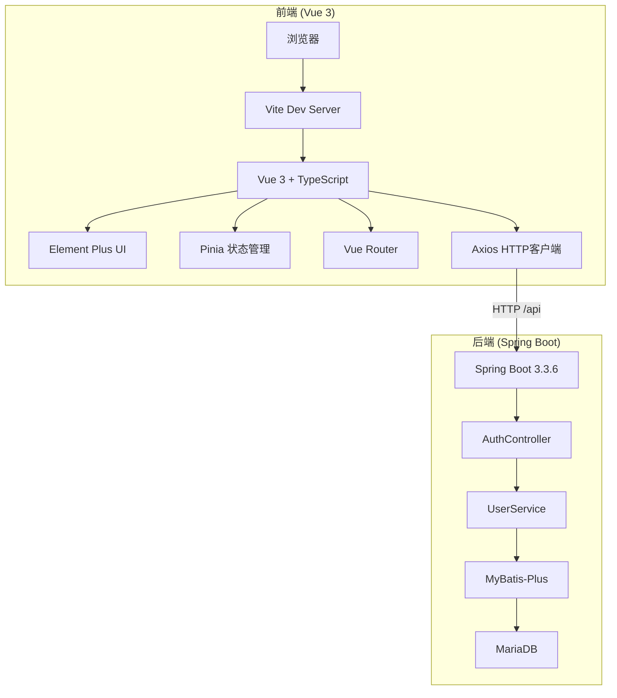
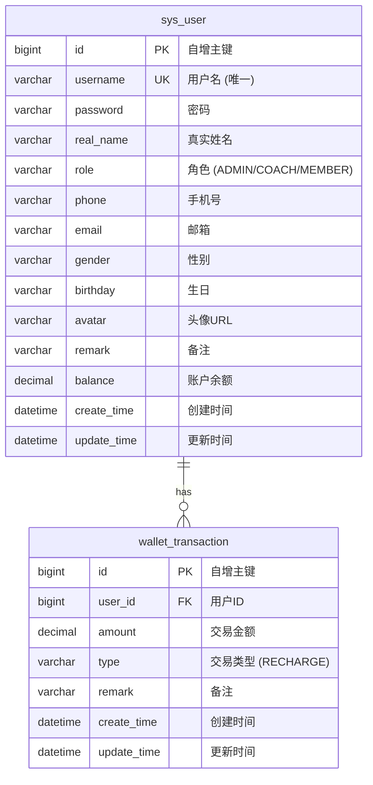
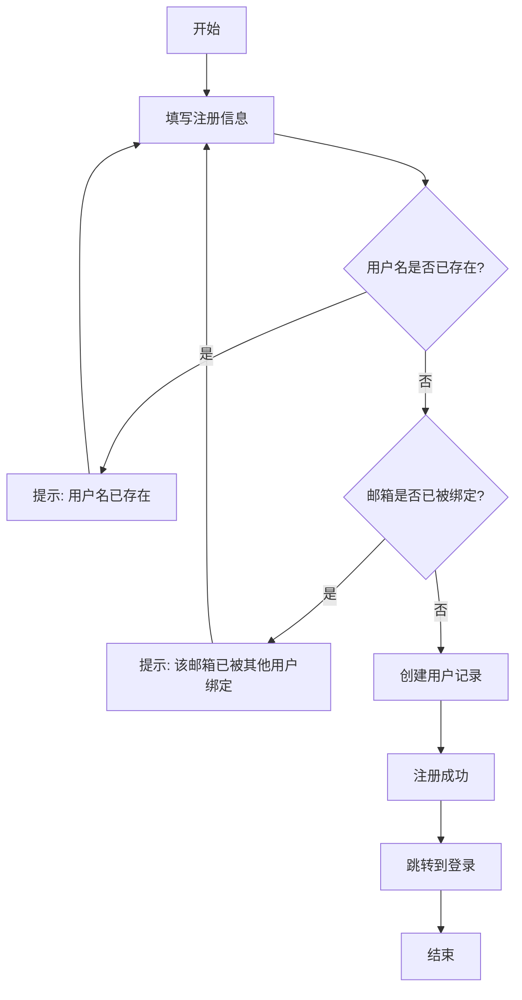
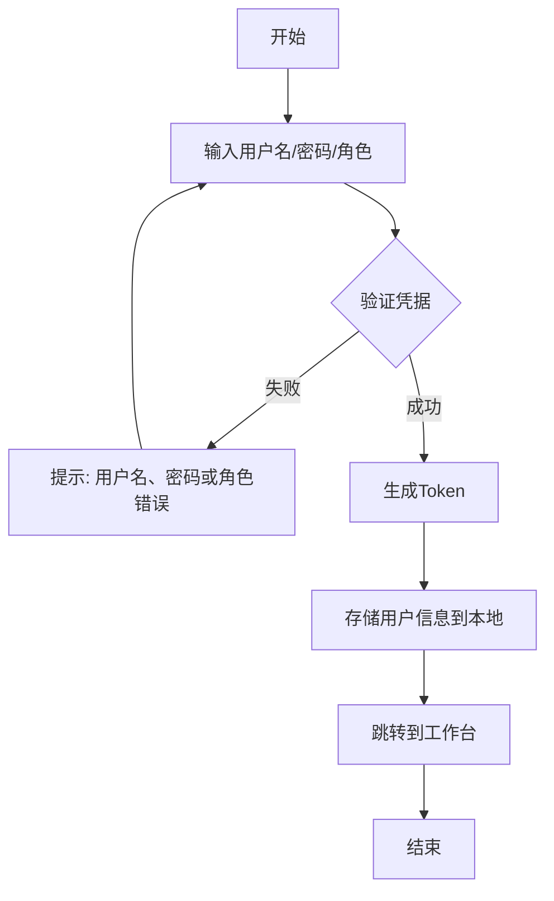
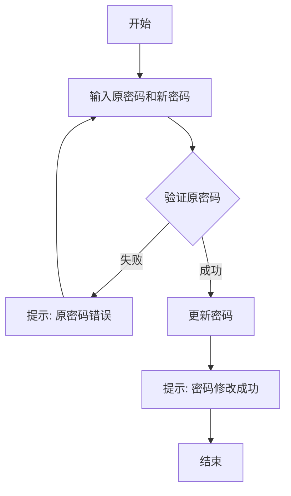
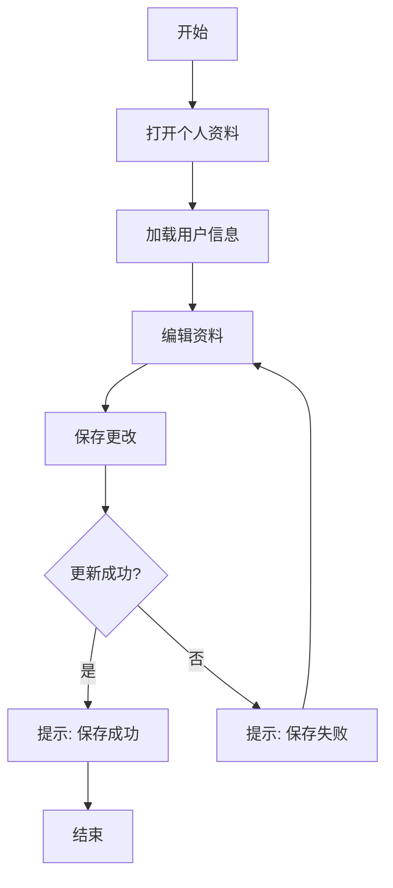
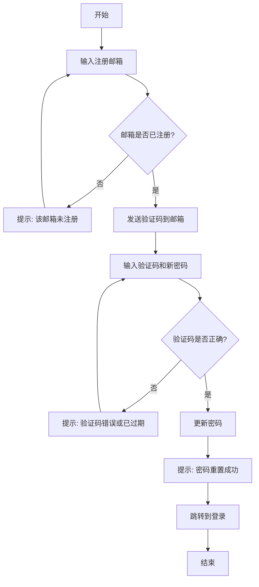
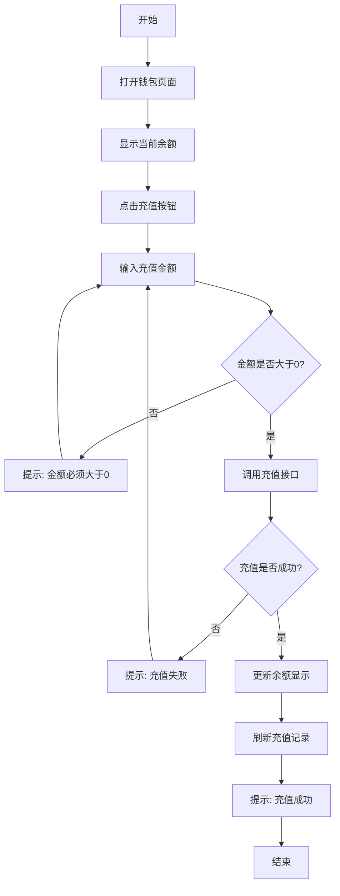
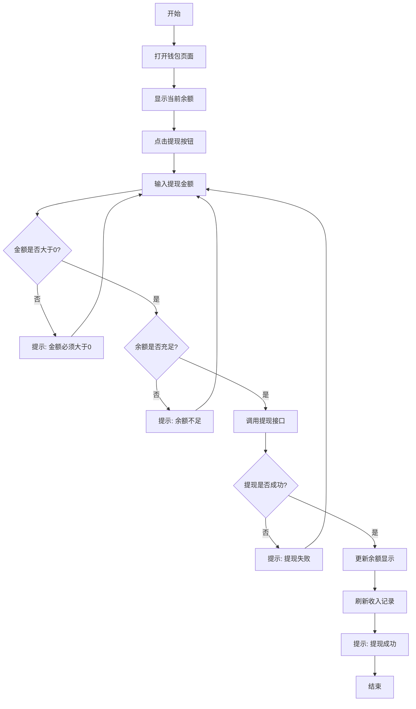

# 智训业财云 - 系统架构与业务文档

## 1. 项目简介

### 1.1 产品定位
**智训业财云** (Zhixun ERP) 是一款面向体育训练/健身行业的ERP管理系统，旨在为训练机构提供一体化的业务管理解决方案。

### 1.2 目标用户
系统定义了三种用户角色：

| 角色 | 标识 | 职责 |
|------|------|------|
| 管理员 | ADMIN | 系统管理、用户管理、数据维护 |
| 教练 | COACH | 训练指导、学员管理 |
| 会员 | MEMBER | 训练学员，查看个人信息 |

### 1.3 当前状态
项目处于**早期原型阶段**，已完成以下功能模块：
- 用户管理（注册、登录、密码管理、个人资料管理）
- 管理员用户管理（教练/会员的增删改查、分页、搜索）
- 邮箱验证码找回密码
- 邮箱唯一性约束
- 钱包充值（余额管理、充值流水记录）

---

## 2. 技术架构

### 2.1 整体架构图



### 2.2 后端技术栈

| 组件 | 技术选型 | 版本 | 说明 |
|------|----------|------|------|
| 语言 | Java | 17 | LTS版本 |
| 框架 | Spring Boot | 3.3.6 | 主框架 |
| ORM | MyBatis-Plus | 3.5.9 | 数据库访问层 |
| 数据库 | MariaDB | - | MySQL兼容 |
| 热启动 | Spring Boot DevTools | - | 代码修改后自动重启 |
| 邮件 | Spring Mail | - | QQ邮箱SMTP发送验证码 |
| 连接池 | HikariCP | - | Spring Boot默认 |
| 构建工具 | Maven | - | 依赖管理 |
| 工具库 | Lombok | 1.18.36 | 减少样板代码 |

### 2.3 前端技术栈

| 组件 | 技术选型 | 版本 | 说明 |
|------|----------|------|------|
| 框架 | Vue 3 | latest | Composition API |
| 语言 | TypeScript | - | 类型安全 |
| 构建工具 | Vite | latest | 快速开发 |
| UI组件库 | Element Plus | latest | 企业级UI |
| 状态管理 | Pinia | latest | Vue 3官方推荐 |
| 路由 | Vue Router | 4 | 单页应用路由 |
| HTTP客户端 | Axios | latest | API请求 |

---

## 3. 项目目录结构

### 3.1 后端目录结构

```
backend/
├── pom.xml                                    # Maven构建配置
└── src/
    └── main/
        ├── resources/
        │   ├── application.yml                # Spring Boot配置
        │   └── schema.sql                     # 数据库DDL
        └── java/com/zhixun/erp/
            ├── ZhixunErpApplication.java      # 主启动类
            ├── common/
            │   ├── exception/
            │   │   └── GlobalExceptionHandler.java  # 全局异常处理
            │   └── response/
            │       └── Result.java            # 统一响应封装
            ├── config/
            │   └── MybatisPlusConfig.java     # MyBatis-Plus分页插件配置
            ├── finance/
            │   ├── controller/
            │   │   └── FinanceController.java # 钱包控制器 (3个端点)
            │   ├── dto/
            │   │   └── RechargeRequest.java   # 充值请求DTO
            │   ├── entity/
            │   │   └── WalletTransaction.java # 充值流水实体
            │   ├── mapper/
            │   │   └── WalletTransactionMapper.java # MyBatis-Plus Mapper
            │   └── service/
            │       └── FinanceService.java    # 钱包业务逻辑
            └── user/
                ├── controller/
                │   ├── AuthController.java    # 认证控制器 (8个端点)
                │   └── UserController.java    # 用户管理控制器 (5个端点)
                ├── dto/
                │   ├── RegisterRequest.java   # 注册请求DTO
                │   ├── LoginRequest.java      # 登录请求DTO
                │   ├── ChangePasswordRequest.java  # 修改密码DTO
                │   ├── ResetPasswordRequest.java   # 重置密码DTO
                │   ├── UpdateProfileRequest.java   # 更新资料DTO
                │   ├── UpdateUserRequest.java      # 更新用户DTO
                │   ├── SendCodeRequest.java        # 发送验证码DTO
                │   └── ResetPasswordByCodeRequest.java # 验证码重置密码DTO
                ├── entity/
                │   └── User.java              # 用户实体
                ├── mapper/
                │   └── UserMapper.java        # MyBatis-Plus Mapper
                ├── service/
                │   ├── UserService.java       # 用户业务逻辑
                │   └── EmailService.java      # 邮箱验证码服务
                └── vo/
                    ├── LoginResponse.java     # 登录响应VO
                    └── UserProfileResponse.java # 用户资料VO
```

### 3.2 前端目录结构

```
frontend/
├── .env.development                           # 开发环境变量
├── index.html                                 # HTML入口
├── package.json                               # 依赖配置
├── tsconfig.json                              # TypeScript配置
├── vite.config.ts                             # Vite构建配置
└── src/
    ├── main.ts                                # 应用入口
    ├── App.vue                                # 根组件
    ├── style.css                              # 全局样式
    ├── api/
    │   ├── auth.ts                            # 认证API函数与类型定义
    │   ├── finance.ts                         # 钱包API函数与类型定义
    │   └── user.ts                            # 用户管理API函数与类型定义
    ├── layouts/
    │   └── AdminLayout.vue                    # 管理后台布局
    ├── router/
    │   └── index.ts                           # 路由配置
    ├── stores/
    │   └── user.ts                            # 用户状态管理
    ├── styles/
    │   ├── layouts/
    │   │   └── admin-layout.css               # 布局样式
    │   └── views/
    │       ├── login.css                      # 登录页样式
    │       └── workbench.css                  # 工作台样式
    ├── utils/
    │   └── request.ts                         # Axios封装
    └── views/
        ├── LoginView.vue                      # 登录/注册页
        ├── WorkbenchView.vue                  # 工作台页面
        ├── CoachView.vue                      # 教练信息管理页
        ├── CoachSalaryView.vue                # 教练工资管理页
        ├── MemberView.vue                     # 会员信息管理页
        ├── MemberBalanceView.vue              # 会员金额管理页
        └── WalletView.vue                     # 钱包页面
```

---

## 4. 数据库设计

### 4.1 ER图



### 4.2 字段详细说明

| 字段 | 类型 | 约束 | 说明 |
|------|------|------|------|
| id | BIGINT | PK, AUTO_INCREMENT | 自增主键 |
| username | VARCHAR(64) | UNIQUE, NOT NULL | 用户名，唯一标识 |
| password | VARCHAR(128) | NOT NULL | 密码（当前明文存储） |
| real_name | VARCHAR(64) | - | 真实姓名 |
| role | VARCHAR(32) | NOT NULL | 用户角色：ADMIN/COACH/MEMBER |
| phone | VARCHAR(32) | - | 手机号码 |
| email | VARCHAR(128) | - | 电子邮箱 |
| gender | VARCHAR(16) | - | 性别 |
| birthday | VARCHAR(32) | - | 生日（存储为字符串） |
| avatar | VARCHAR(255) | - | 头像URL |
| remark | VARCHAR(500) | - | 备注信息 |
| balance | DECIMAL(10,2) | DEFAULT 0.00 | 账户余额 |
| create_time | DATETIME | - | 记录创建时间 |
| update_time | DATETIME | - | 记录更新时间 |
| deleted | TINYINT | DEFAULT 0 | 逻辑删除标志：0=正常，1=已删除 |

### 4.3 wallet_transaction 表（充值流水）

| 字段 | 类型 | 约束 | 说明 |
|------|------|------|------|
| id | BIGINT | PK, AUTO_INCREMENT | 自增主键 |
| user_id | BIGINT | NOT NULL, FK | 关联 sys_user.id |
| amount | DECIMAL(10,2) | NOT NULL | 交易金额 |
| type | VARCHAR(32) | NOT NULL | 交易类型：RECHARGE（充值） |
| remark | VARCHAR(255) | - | 备注信息 |
| create_time | DATETIME | - | 记录创建时间 |
| update_time | DATETIME | - | 记录更新时间 |
| deleted | TINYINT | DEFAULT 0 | 逻辑删除标志：0=正常，1=已删除 |

---

## 5. API接口文档

### 5.1 统一响应格式

所有API返回统一的JSON格式：

```json
{
  "code": 200,
  "message": "操作成功",
  "data": {}
}
```

| 字段 | 类型 | 说明 |
|------|------|------|
| code | Integer | 状态码，200表示成功 |
| message | String | 提示信息 |
| data | Object | 响应数据 |

### 5.2 接口列表

#### 5.2.1 用户注册

- **URL**: `POST /api/auth/register`
- **功能**: 新用户注册（不允许注册管理员）

**请求参数**:
```json
{
  "username": "string",
  "password": "string",
  "realName": "string",
  "role": "COACH | MEMBER",
  "phone": "string",
  "email": "string"
}
```

**响应示例**:
```json
{
  "code": 200,
  "message": "注册成功",
  "data": {
    "id": 1,
    "username": "coach001",
    "realName": "张教练",
    "role": "COACH",
    "phone": "13800138000",
    "email": "coach@example.com"
  }
}
```

**业务逻辑**:
1. 检查角色是否为ADMIN，如果是则拒绝注册
2. 检查用户名是否已存在
3. 检查邮箱是否已被其他用户绑定
4. 创建用户记录，密码明文存储
5. 返回用户基本信息

---

#### 5.2.2 用户登录

- **URL**: `POST /api/auth/login`
- **功能**: 用户身份验证

**请求参数**:
```json
{
  "username": "string",
  "password": "string",
  "role": "ADMIN | COACH | MEMBER"
}
```

**响应示例**:
```json
{
  "code": 200,
  "message": "登录成功",
  "data": {
    "id": 1,
    "username": "coach001",
    "realName": "张教练",
    "role": "COACH",
    "phone": "13800138000",
    "email": "coach@example.com",
    "token": "550e8400-e29b-41d4-a716-446655440000"
  }
}
```

**业务逻辑**:
1. 根据用户名+密码+角色三元组查询数据库
2. 如无匹配记录则抛出异常"用户名、密码或角色错误"
3. 生成随机UUID作为token返回（未存储、未验证）

---

#### 5.2.3 修改密码

- **URL**: `POST /api/auth/change-password`
- **功能**: 用户修改自己的密码

**请求参数**:
```json
{
  "username": "string",
  "role": "ADMIN | COACH | MEMBER",
  "oldPassword": "string",
  "newPassword": "string"
}
```

**响应示例**:
```json
{
  "code": 200,
  "message": "密码修改成功",
  "data": null
}
```

**业务逻辑**:
1. 验证用户名+角色+原密码是否匹配
2. 如不匹配则抛出异常"用户名、角色或原密码错误"
3. 更新密码为新值（明文存储）

---

#### 5.2.4 重置密码

- **URL**: `POST /api/auth/reset-password`
- **功能**: 管理员级密码重置（无需验证旧密码）

**请求参数**:
```json
{
  "username": "string",
  "role": "ADMIN | COACH | MEMBER",
  "newPassword": "string"
}
```

**响应示例**:
```json
{
  "code": 200,
  "message": "密码重置成功",
  "data": null
}
```

**业务逻辑**:
1. 验证用户名+角色是否存在
2. 如不存在则抛出异常"用户不存在或身份不匹配"
3. 直接更新密码为新值（无需旧密码）

---

#### 5.2.5 获取个人资料

- **URL**: `GET /api/auth/profile/{id}`
- **功能**: 根据用户ID获取个人资料

**路径参数**:
| 参数 | 类型 | 说明 |
|------|------|------|
| id | Long | 用户ID |

**响应示例**:
```json
{
  "code": 200,
  "message": "success",
  "data": {
    "id": 1,
    "username": "coach001",
    "realName": "张教练",
    "role": "COACH",
    "phone": "13800138000",
    "email": "coach@example.com",
    "gender": "男",
    "birthday": "1990-01-01",
    "avatar": "https://example.com/avatar.jpg",
    "remark": "高级教练"
  }
}
```

---

#### 5.2.6 更新个人资料

- **URL**: `POST /api/auth/profile`
- **功能**: 更新用户个人信息

**请求参数**:
```json
{
  "id": 1,
  "realName": "string",
  "phone": "string",
  "email": "string",
  "gender": "string",
  "birthday": "string",
  "avatar": "string",
  "remark": "string"
}
```

**响应示例**:
```json
{
  "code": 200,
  "message": "个人信息保存成功",
  "data": {
    "id": 1,
    "username": "coach001",
    "realName": "张教练",
    "role": "COACH",
    "phone": "13800138000",
    "email": "coach@example.com",
    "gender": "男",
    "birthday": "1990-01-01",
    "avatar": "https://example.com/avatar.jpg",
    "remark": "高级教练"
  }
}
```

**业务逻辑**:
1. 根据ID查询用户
2. 如不存在则抛出异常"用户不存在"
3. 更新可编辑字段（realName, phone, email, gender, birthday, avatar, remark）
4. 设置updateTime为当前时间
5. 返回更新后的用户资料

---

#### 5.2.7 发送邮箱验证码

- **URL**: `POST /api/auth/send-code`
- **功能**: 发送邮箱验证码用于找回密码

**请求参数**:
```json
{
  "contact": "user@example.com"
}
```

**响应示例**:
```json
{
  "code": 200,
  "message": "验证码已发送到邮箱",
  "data": null
}
```

**业务逻辑**:
1. 检查邮箱是否已注册
2. 如未注册则抛出异常"该邮箱未注册"
3. 生成6位随机验证码
4. 发送验证码到邮箱
5. 验证码5分钟内有效

---

#### 5.2.8 验证码重置密码

- **URL**: `POST /api/auth/reset-password-by-code`
- **功能**: 通过邮箱验证码重置密码

**请求参数**:
```json
{
  "contact": "user@example.com",
  "code": "123456",
  "newPassword": "newpassword"
}
```

**响应示例**:
```json
{
  "code": 200,
  "message": "密码重置成功",
  "data": null
}
```

**业务逻辑**:
1. 验证验证码是否正确且未过期
2. 如验证失败则抛出异常"验证码错误或已过期"
3. 根据邮箱查询用户
4. 更新密码为新值

---

### 5.3 用户管理接口（管理员专用）

#### 5.3.1 管理员注册用户

- **URL**: `POST /api/user/register`
- **功能**: 管理员注册新用户（可注册任何角色）

**请求参数**:
```json
{
  "username": "string",
  "password": "string",
  "realName": "string",
  "role": "COACH | MEMBER",
  "phone": "string",
  "email": "string"
}
```

**响应示例**:
```json
{
  "code": 200,
  "message": "注册成功",
  "data": {
    "id": 5,
    "username": "newcoach",
    "realName": "新教练",
    "role": "COACH"
  }
}
```

**业务逻辑**:
1. 检查用户名是否已存在
2. 检查邮箱是否已被其他用户绑定
3. 创建用户记录

---

#### 5.3.2 分页查询用户列表

- **URL**: `GET /api/user/list`
- **功能**: 按角色分页查询用户，支持模糊搜索

**请求参数（Query）**:

| 参数 | 类型 | 必填 | 说明 |
|------|------|------|------|
| `pageNum` | int | 否 | 页码，默认1 |
| `pageSize` | int | 否 | 每页条数，默认10 |
| `keyword` | string | 否 | 搜索关键词（匹配用户名/姓名/手机号） |
| `role` | string | 是 | 用户角色（COACH 或 MEMBER） |

**响应示例**:
```json
{
  "code": 200,
  "message": "success",
  "data": {
    "records": [
      {
        "id": 2,
        "username": "coach",
        "realName": "张教练",
        "role": "COACH",
        "phone": "13800138000",
        "email": "coach@example.com",
        "gender": "男",
        "birthday": "1990-01-01",
        "avatar": null,
        "remark": "高级教练",
        "createTime": "2026-06-17T16:00:00",
        "updateTime": null
      }
    ],
    "total": 1,
    "size": 10,
    "current": 1,
    "pages": 1
  }
}
```

---

#### 5.3.3 更新用户信息

- **URL**: `PUT /api/user`
- **功能**: 管理员编辑用户资料（含用户名、密码、身份）

**请求参数**:
```json
{
  "id": 2,
  "username": "coach001",
  "password": "newpassword",
  "role": "COACH",
  "realName": "张教练",
  "phone": "13800138000",
  "email": "coach@example.com",
  "gender": "男",
  "birthday": "1990-01-01",
  "remark": "高级教练"
}
```

**响应**:
```json
{
  "code": 200,
  "message": "更新成功",
  "data": null
}
```

**业务逻辑**:
1. 根据ID查询用户
2. 如不存在则抛出异常"用户不存在"
3. 如修改用户名，检查新用户名是否已存在
4. 如修改邮箱，检查新邮箱是否已被其他用户绑定
5. 如密码不为空则更新密码
6. 更新其他可编辑字段

---

#### 5.3.4 删除用户

- **URL**: `DELETE /api/user/{id}`
- **功能**: 逻辑删除单个用户

**路径参数**:

| 参数 | 类型 | 说明 |
|------|------|------|
| `id` | Long | 用户ID |

**响应**:
```json
{
  "code": 200,
  "message": "删除成功",
  "data": null
}
```

---

#### 5.3.5 批量删除用户

- **URL**: `DELETE /api/user/batch`
- **功能**: 批量逻辑删除用户

**请求参数**（Body）:
```json
[2, 3, 4]
```

**响应**:
```json
{
  "code": 200,
  "message": "批量删除成功",
  "data": null
}
```

---

### 5.4 钱包管理接口

#### 5.4.1 会员充值

- **URL**: `POST /api/finance/recharge`
- **功能**: 为指定会员增加余额，并记录充值流水

**请求参数**:
```json
{
  "userId": 1,
  "amount": 100.00,
  "remark": "充值100元"
}
```

**响应示例**:
```json
{
  "code": 200,
  "message": "充值成功",
  "data": {
    "id": 1,
    "username": "member001",
    "realName": "张三",
    "role": "MEMBER",
    "balance": 100.00
  }
}
```

**业务逻辑**:
1. 校验充值金额必须大于0
2. 查询用户是否存在
3. 在事务中更新用户余额（balance += amount）
4. 插入充值流水记录（type = "RECHARGE"）
5. 返回更新后的用户信息

---

#### 5.4.2 查询余额

- **URL**: `GET /api/finance/balance/{userId}`
- **功能**: 查询指定用户的当前余额

**路径参数**:

| 参数 | 类型 | 说明 |
|------|------|------|
| userId | Long | 用户ID |

**响应示例**:
```json
{
  "code": 200,
  "message": "success",
  "data": 100.00
}
```

---

#### 5.4.3 查询充值流水

- **URL**: `GET /api/finance/transactions`
- **功能**: 分页查询指定用户的充值流水记录

**请求参数（Query）**:

| 参数 | 类型 | 必填 | 说明 |
|------|------|------|------|
| userId | Long | 是 | 用户ID |
| pageNum | int | 否 | 页码，默认1 |
| pageSize | int | 否 | 每页条数，默认10 |

**响应示例**:
```json
{
  "code": 200,
  "message": "success",
  "data": {
    "records": [
      {
        "id": 1,
        "userId": 1,
        "amount": 100.00,
        "type": "RECHARGE",
        "remark": "充值100元",
        "createTime": "2026-06-18T10:00:00"
      }
    ],
    "total": 1,
    "size": 10,
    "current": 1,
    "pages": 1
  }
}
```

---

#### 5.4.4 修改会员余额（管理员）

- **URL**: `PUT /api/finance/balance`
- **功能**: 管理员直接修改指定会员的余额

**请求参数**:
```json
{
  "userId": 1,
  "balance": 500.00
}
```

**响应示例**:
```json
{
  "code": 200,
  "message": "余额更新成功",
  "data": {
    "id": 1,
    "username": "member001",
    "realName": "张三",
    "role": "MEMBER",
    "balance": 500.00
  }
}
```

**业务逻辑**:
1. 校验余额不能为负数
2. 查询用户是否存在
3. 计算差额，在事务中更新余额
4. 记录调整流水（type = "ADJUST"）
5. 返回更新后的用户信息

---

#### 5.4.5 教练提现

- **URL**: `POST /api/finance/withdraw`
- **功能**: 教练从余额中提现

**请求参数**:
```json
{
  "userId": 1,
  "amount": 200.00,
  "remark": "提现200元"
}
```

**响应示例**:
```json
{
  "code": 200,
  "message": "提现成功",
  "data": {
    "id": 1,
    "username": "coach001",
    "realName": "张教练",
    "role": "COACH",
    "balance": 800.00
  }
}
```

**业务逻辑**:
1. 校验提现金额必须大于0
2. 查询用户是否存在
3. 校验余额是否充足（balance >= amount）
4. 在事务中扣减余额（balance -= amount）
5. 记录提现流水（type = "WITHDRAW"）
6. 返回更新后的用户信息

---

## 6. 业务流程

### 6.1 注册流程



### 6.2 登录流程



### 6.3 修改密码流程



### 6.4 个人资料管理流程



### 6.5 忘记密码流程（邮箱验证码）



### 6.6 充值流程



### 6.7 提现流程（教练）



---

## 7. 前端架构

### 7.1 路由配置

| 路径 | 名称 | 组件 | 守卫逻辑 |
|------|------|------|----------|
| `/` | - | 重定向到 `/login` | - |
| `/login` | login | LoginView.vue | 已登录则跳转 `/dashboard/workbench` |
| `/dashboard` | - | AdminLayout.vue | 未登录则跳转 `/login` |
| `/dashboard/workbench` | workbench | WorkbenchView.vue | 继承父路由守卫 |
| `/dashboard/coaches` | coaches | CoachView.vue | 继承父路由守卫 |
| `/dashboard/coach-salary` | coach-salary | CoachSalaryView.vue | 继承父路由守卫 |
| `/dashboard/members` | members | MemberView.vue | 继承父路由守卫 |
| `/dashboard/member-balance` | member-balance | MemberBalanceView.vue | 继承父路由守卫 |
| `/dashboard/wallet` | wallet | WalletView.vue | 继承父路由守卫 |

**导航守卫逻辑**:
- 未登录用户访问 `/dashboard/**` → 重定向到 `/login`
- 已登录用户访问 `/login` → 重定向到 `/dashboard/workbench`
- Token检查: `localStorage.getItem('access_token')`

**管理员专属菜单**:
- 仅 ADMIN 角色可见"用户管理"父菜单
- 子菜单：教练信息 (`/dashboard/coaches`)、教练工资 (`/dashboard/coach-salary`)、会员信息 (`/dashboard/members`)、会员金额 (`/dashboard/member-balance`)

**教练/会员专属菜单**:
- 仅 COACH 和 MEMBER 角色可见"我的"父菜单
- 子菜单：钱包 (`/dashboard/wallet`)

### 7.2 状态管理 (Pinia Store)

**Store名称**: `user`

**状态结构**:
```typescript
{
  user: LoginResult | null  // 用户信息，包含token
}
```

**持久化策略**: 双重持久化
- Pinia内存状态
- localStorage存储 `access_token` 和 `user_info`

**Actions**:
| 方法 | 功能 |
|------|------|
| `setUser(user)` | 设置用户状态，同时存储到localStorage |
| `updateProfile(profile)` | 更新用户资料，同步到localStorage |
| `logout()` | 清除状态和localStorage |

### 7.3 HTTP请求封装

**Axios配置**:
- 基础URL: `/api` (通过环境变量 `VITE_API_BASE_URL` 配置)
- 超时时间: 15000ms

**请求拦截器**:
- 自动添加 `Authorization: Bearer <token>` 请求头

**响应拦截器**:
- 成功响应: 解析 `ApiResponse.data`，当 `code === 200` 时返回数据
- 失败响应: 返回错误信息
- 401状态码: 清除 `access_token`

### 7.4 页面与组件结构

```
App.vue (根组件)
├── LoginView.vue (登录/注册页)
│   ├── 角色选择器 (注册时仅Coach/Member，登录时含Admin)
│   ├── 登录表单
│   ├── 注册表单 (含手机号、邮箱)
│   └── 忘记密码对话框 (邮箱验证码)
│
└── AdminLayout.vue (管理后台布局)
    ├── 侧边栏 (236px)
    │   ├── Logo区域
    │   └── 导航菜单
    │       ├── 工作栏 (所有角色可见)
    │       ├── 用户管理 (仅ADMIN可见)
    │       │   ├── 教练信息
    │       │   ├── 教练工资
    │       │   ├── 会员信息
    │       │   └── 会员金额
    │       └── 我的 (仅COACH/MEMBER可见)
    │           └── 钱包
    ├── 顶部栏 (76px)
    │   ├── 页面标题
    │   └── 用户面板 (角色标签、用户名、操作按钮)
    ├── <router-view /> (子路由出口)
    │   ├── WorkbenchView.vue (工作台)
    │   ├── CoachView.vue (教练信息管理 - 增删改查、分页、搜索)
    │   ├── CoachSalaryView.vue (教练工资管理 - 查看/修改余额)
    │   ├── MemberView.vue (会员信息管理 - 增删改查、分页、搜索)
    │   ├── MemberBalanceView.vue (会员金额管理 - 查看/修改余额)
    │   └── WalletView.vue (钱包 - 会员充值/教练提现、交易记录)
    ├── 个人资料对话框
    └── 修改密码对话框
```

---

## 8. 安全与已知问题

### 8.1 当前安全缺陷

| 问题 | 严重程度 | 说明 |
|------|----------|------|
| 密码明文存储 | **严重** | 密码未使用BCrypt等哈希算法，数据库泄露将导致所有密码暴露 |
| Token未验证 | **严重** | 登录返回的UUID token未存储、未验证，任何人都可以访问所有API |
| 无认证鉴权 | **严重** | 没有Spring Security，所有API端点公开访问 |
| 无输入校验 | 中等 | DTO没有@Valid注解，未验证输入参数 |
| 无测试 | 中等 | 前后端均无单元测试或集成测试 |
| CORS全开 | 低 | @CrossOrigin允许所有来源，生产环境应限制 |

### 8.2 已实现的安全措施

| 措施 | 说明 |
|------|------|
| 邮箱唯一性 | 每个邮箱只能绑定一个用户 |
| 注册限制 | 公开注册接口不允许注册管理员角色 |
| 邮箱验证码 | 找回密码需要邮箱验证码验证 |

### 8.2 改进建议

#### 8.2.1 密码安全
```java
// 使用BCrypt进行密码哈希
import org.springframework.security.crypto.bcrypt.BCryptPasswordEncoder;

@Service
public class UserService {
    private final BCryptPasswordEncoder passwordEncoder = new BCryptPasswordEncoder();
    
    public User register(RegisterRequest request) {
        User user = new User();
        user.setPassword(passwordEncoder.encode(request.getPassword()));
        // ...
    }
}
```

#### 8.2.2 JWT认证
```java
// 引入JWT依赖
// pom.xml: spring-boot-starter-security, jjwt-api

// 生成JWT Token
import io.jsonwebtoken.Jwts;

public String generateToken(User user) {
    return Jwts.builder()
        .setSubject(user.getUsername())
        .claim("role", user.getRole())
        .setExpiration(new Date(System.currentTimeMillis() + 86400000))
        .signWith(SignatureAlgorithm.HS256, "secret-key")
        .compact();
}
```

#### 8.2.3 输入校验
```java
// 在DTO中添加校验注解
public class RegisterRequest {
    @NotBlank(message = "用户名不能为空")
    @Size(min = 3, max = 64, message = "用户名长度3-64位")
    private String username;
    
    @NotBlank(message = "密码不能为空")
    @Size(min = 6, max = 128, message = "密码长度6-128位")
    private String password;
}
```

#### 8.2.4 Spring Security配置
```java
@Configuration
@EnableWebSecurity
public class SecurityConfig {
    @Bean
    public SecurityFilterChain filterChain(HttpSecurity http) throws Exception {
        http
            .csrf(csrf -> csrf.disable())
            .authorizeHttpRequests(auth -> auth
                .requestMatchers("/api/auth/login", "/api/auth/register").permitAll()
                .anyRequest().authenticated()
            )
            .addFilterBefore(jwtAuthenticationFilter(), UsernamePasswordAuthenticationFilter.class);
        return http.build();
    }
}
```

---

## 附录

### A. 环境配置

**后端 application.yml 关键配置**:
- 服务端口: 8080
- 上下文路径: /api
- 数据库: jdbc:mariadb://localhost:3366/zhixun_erp
- 连接池: HikariCP (最小5, 最大20)
- 邮箱SMTP: smtp.qq.com:465 (SSL)

**前端环境变量**:
- `VITE_API_BASE_URL=/api`

### B. 启动命令

**后端**:
```bash
cd backend
mvn spring-boot:run
```

**前端**:
```bash
cd frontend
npm install
npm run dev
```

### C. 热启动配置

项目已配置热启动（Hot Reload），修改代码后自动生效：

**后端 (Spring Boot DevTools)**:
- 依赖：`spring-boot-devtools`（已在 `pom.xml` 中配置）
- Java 文件修改 → 应用自动重启
- 静态资源修改 → 自动刷新

**前端 (Vite HMR)**:
- Vite 内置热模块替换（HMR），无需额外配置
- `.vue` 文件修改 → 组件热更新
- `.ts`/`.js` 文件修改 → 页面自动刷新
- CSS 修改 → 样式即时替换

### D. 数据库初始化

数据库会在Spring Boot启动时自动执行 `schema.sql` 创建表结构。
如需手动初始化：
```sql
CREATE DATABASE IF NOT EXISTS zhixun_erp CHARACTER SET utf8mb4 COLLATE utf8mb4_unicode_ci;
```

### E. 账号配置

系统已预置三个测试账号：

| 角色 | 用户名 | 密码 |
|------|--------|------|
| 管理员 | admin | admin123 |
| 教练 | coach | coach123 |
| 会员 | member | member123 |
