# 智训业财云 - 系统架构与业务文档

## 1. 项目简介

### 1.1 产品定位
**智训业财云** (Zhixun ERP) 是一款面向体育训练/健身行业的ERP管理系统，旨在为训练机构提供一体化的业务管理解决方案。

### 1.2 目标用户
系统定义了三种用户角色：

| 角色 | 标识 | 职责 |
|------|------|------|
| 管理员 | ADMIN | 系统管理、用户管理、数据维护 |
| 教练 | COACH | 训练指导、学员管理 |
| 会员 | MEMBER | 训练学员，查看个人信息 |

### 1.3 当前状态
项目已完成以下功能模块：
- 用户管理（注册、登录、密码管理、个人资料管理）
- 管理员用户管理（教练/会员的增删改查、分页、搜索）
- 邮箱验证码找回密码
- 邮箱唯一性约束
- 钱包充值（余额管理、充值流水记录、提现、账单导出）
- 课程管理（公共课/私教、选课、试听付费、教练课程管理、学员管理）
- **排课系统**（手动排课、自动排课、教练课表、学员课表、拖拽排课）
- **运动记录**（运动类型记录、统计数据、趋势图表、心率分析）
- **健康档案**（身体数据、健康信息、紧急联系人、健身目标管理）
- **文件管理**（文件上传、下载、删除、列表管理）
- **CSV数据分析**（CSV文件上传解析、数值列统计、心率区间分析）
- **落地页**（营销展示页、GSAP动画、品牌展示、用户评价）
- 系统管理（管理员专用：日志管理、SQL监控、系统监控、数据库控制）
- 聊天功能（教练/会员：群聊、私信、WebSocket实时通信、消息通知、好友申请、群聊管理、群公告）
- **签到系统**（课前签到、签到窗口验证、自动缺勤标记、签到统计）
- **AI 智能助手**（LangChain4j + DeepSeek、SSE 流式对话、5个业务工具：排课查询/余额查询/运动分析/锻炼计划/签到统计）

---

## 2. 技术架构

### 2.1 整体架构图

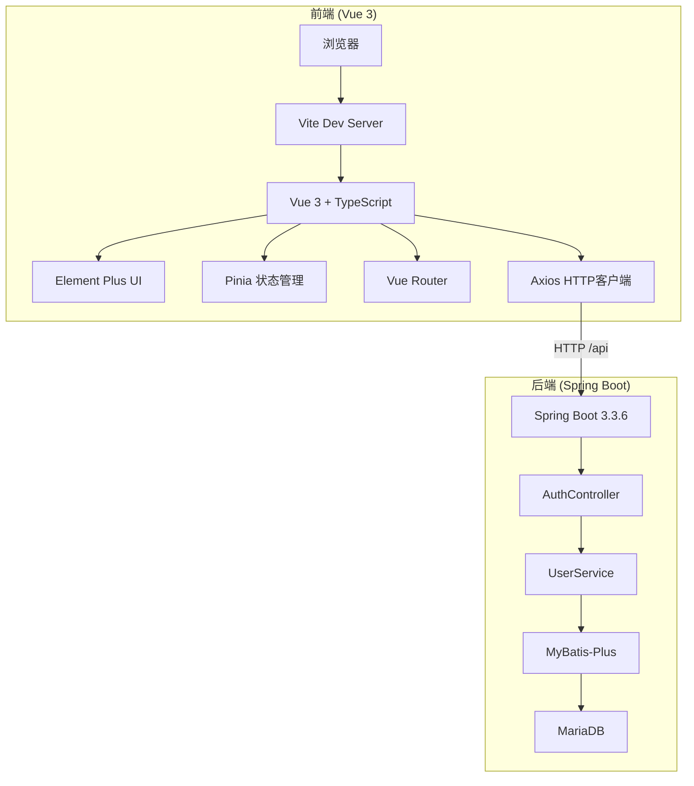

### 2.2 后端技术栈

| 组件 | 技术选型 | 版本 | 说明 |
|------|----------|------|------|
| 语言 | Java | 17 | LTS版本 |
| 框架 | Spring Boot | 3.3.6 | 主框架 |
| ORM | MyBatis-Plus | 3.5.9 | 数据库访问层 |
| 数据库 | MariaDB | - | MySQL兼容 |
| 热启动 | Spring Boot DevTools | - | 代码修改后自动重启 |
| 邮件 | Spring Mail | - | QQ邮箱SMTP发送验证码 |
| 连接池 | Druid | 1.2.23 | 数据库连接池 + SQL监控 |
| SQL监控 | Druid StatViewServlet | - | 内置SQL监控UI（/api/druid/） |
| 系统监控 | OSHI | 6.1.0 | 跨平台系统信息采集 |
| AOP | Spring AOP | - | 操作日志切面记录 |
| WebSocket | Spring WebSocket | - | 实时聊天通信 |
| WebFlux | Spring WebFlux | - | 响应式编程，支持SSE流式传输 |
| AI框架 | LangChain4j | 1.0.0-beta3 | AI Agent框架，工具调用、对话记忆 |
| AI模型 | langchain4j-open-ai | 1.0.0-beta3 | OpenAI兼容模型集成（DeepSeek） |
| AI流式 | langchain4j-reactor | 1.0.0-beta3 | Reactor集成，Flux流式响应 |
| 构建工具 | Maven | - | 依赖管理 |
| 工具库 | Lombok | 1.18.36 | 减少样板代码 |

### 2.3 前端技术栈

| 组件 | 技术选型 | 版本 | 说明 |
|------|----------|------|------|
| 框架 | Vue 3 | latest | Composition API |
| 语言 | TypeScript | - | 类型安全 |
| 构建工具 | Vite | latest | 快速开发 |
| UI组件库 | Element Plus | latest | 企业级UI |
| 状态管理 | Pinia | latest | Vue 3官方推荐 |
| 路由 | Vue Router | 4 | 单页应用路由 |
| HTTP客户端 | Axios | latest | API请求 |
| 动画库 | GSAP | ^3.15.0 | 落地页动画效果 |
| CSS工具 | Tailwind CSS | ^4.3.1 | 实用优先CSS框架 |
| 图表库 | ECharts | ^6.1.0 | 运动数据可视化 |

---

## 3. 项目目录结构

### 3.1 后端目录结构

```
backend/
├── pom.xml                                    # Maven构建配置
└── src/
    └── main/
        ├── resources/
        │   ├── application.yml                # Spring Boot配置
        │   ├── schema.sql                     # 数据库DDL
        │   └── fitness-assistant.md           # AI助手系统提示词
        └── java/com/zhixun/erp/
            ├── ZhixunErpApplication.java      # 主启动类
            ├── common/
            │   ├── exception/
            │   │   └── GlobalExceptionHandler.java  # 全局异常处理
            │   └── response/
            │       └── Result.java            # 统一响应封装
            ├── config/
            │   ├── MybatisPlusConfig.java     # MyBatis-Plus分页插件配置
            │   ├── DruidDataSourceConfig.java # Druid数据源手动配置
            │   └── WebFluxConfig.java         # WebFlux配置（SSE UTF-8编码过滤器）
            ├── chat/
            │   ├── config/
            │   │   └── WebSocketConfig.java   # WebSocket配置
            │   ├── entity/
            │   │   ├── ChatConversation.java  # 会话实体
            │   │   ├── ChatConversationMember.java # 会话成员实体
            │   │   ├── ChatMessage.java       # 聊天消息实体
            │   │   ├── ChatFriendRequest.java # 好友/加群申请实体
            │   │   ├── ChatReadStatus.java    # 消息已读状态实体
            │   │   ├── ChatGroupNotice.java   # 群公告实体
            │   │   └── Notification.java      # 通知实体
            │   ├── mapper/
            │   │   ├── ChatConversationMapper.java
            │   │   ├── ChatConversationMemberMapper.java
            │   │   ├── ChatMessageMapper.java
            │   │   ├── ChatFriendRequestMapper.java
            │   │   ├── ChatReadStatusMapper.java
            │   │   ├── ChatGroupNoticeMapper.java
            │   │   └── NotificationMapper.java
            │   ├── service/
            │   │   ├── ChatService.java       # 聊天核心逻辑
            │   │   ├── FriendService.java     # 好友/加群申请逻辑
            │   │   └── NotificationService.java # 通知逻辑
            │   ├── controller/
            │   │   ├── ChatController.java    # 聊天REST API
            │   │   ├── FriendController.java  # 好友/加群申请API
            │   │   └── NotificationController.java # 通知API
            │   └── handler/
            │       └── ChatWebSocketHandler.java # WebSocket消息处理
            ├── system/
            │   ├── aspect/
            │   │   └── LogAspect.java         # 操作日志AOP切面
            │   ├── controller/
            │   │   ├── LogController.java     # 日志管理控制器
            │   │   ├── SystemMonitorController.java # 系统监控控制器
            │   │   └── DbController.java      # 数据库控制控制器
            │   ├── entity/
            │   │   └── SysLog.java            # 操作日志实体
            │   ├── mapper/
            │   │   └── SysLogMapper.java      # 日志Mapper
            │   └── service/
            │       ├── LogService.java        # 日志业务逻辑
            │       ├── SystemMonitorService.java # 系统监控服务(OSHI)
            │       └── DbService.java         # 数据库控制服务
            ├── finance/
            │   ├── controller/
            │   │   └── FinanceController.java # 钱包控制器
            │   ├── dto/
            │   │   ├── RechargeRequest.java   # 充值请求DTO
            │   │   ├── UpdateBalanceRequest.java # 修改余额DTO
            │   │   └── WithdrawRequest.java   # 提现请求DTO
            │   ├── entity/
            │   │   └── WalletTransaction.java # 充值流水实体
            │   ├── mapper/
            │   │   └── WalletTransactionMapper.java # MyBatis-Plus Mapper
            │   └── service/
            │       └── FinanceService.java    # 钱包业务逻辑
            ├── course/
            │   ├── controller/
            │   │   ├── CourseController.java  # 课程控制器
            │   │   ├── LessonController.java  # 课时控制器
            │   │   └── EnrollmentController.java # 选课控制器
            │   ├── dto/
            │   │   ├── CreateCourseRequest.java # 创建课程DTO
            │   │   ├── UpdateCourseRequest.java # 更新课程DTO
            │   │   ├── CreateLessonRequest.java # 添加课时DTO
            │   │   └── EnrollRequest.java     # 选课DTO
            │   ├── entity/
            │   │   ├── Course.java            # 课程实体
            │   │   ├── Lesson.java            # 课时实体
            │   │   └── Enrollment.java        # 选课实体
            │   ├── mapper/
            │   │   ├── CourseMapper.java      # MyBatis-Plus Mapper
            │   │   ├── LessonMapper.java      # MyBatis-Plus Mapper
            │   │   └── EnrollmentMapper.java  # MyBatis-Plus Mapper
            │   └── service/
            │       ├── CourseService.java     # 课程业务逻辑
            │       ├── LessonService.java     # 课时业务逻辑
            │       └── EnrollmentService.java # 选课业务逻辑
            ├── schedule/                      # 排课模块（新增）
            │   ├── controller/
            │   │   └── CourseScheduleController.java # 排课控制器
            │   ├── entity/
            │   │   └── CourseSchedule.java    # 排课实体
            │   ├── mapper/
            │   │   └── CourseScheduleMapper.java # 排课Mapper
            │   └── service/
            │       └── CourseScheduleService.java # 排课业务逻辑（含自动排课算法）
            ├── exercise/                      # 运动记录模块（新增）
            │   ├── controller/
            │   │   └── ExerciseController.java # 运动记录控制器
            │   ├── entity/
            │   │   └── ExerciseRecord.java    # 运动记录实体
            │   ├── mapper/
            │   │   └── ExerciseRecordMapper.java # 运动记录Mapper
            │   └── service/
            │       └── ExerciseService.java   # 运动记录业务逻辑
            ├── health/                        # 健康档案模块（新增）
            │   ├── controller/
            │   │   └── HealthProfileController.java # 健康档案控制器
            │   ├── entity/
            │   │   └── MemberHealthProfile.java # 健康档案实体
            │   ├── mapper/
            │   │   └── MemberHealthProfileMapper.java # 健康档案Mapper
            │   └── service/
            │       └── HealthProfileService.java # 健康档案业务逻辑
            ├── file/                          # 文件管理模块（新增）
            │   ├── controller/
            │   │   └── FileController.java    # 文件管理控制器
            │   ├── entity/
            │   │   └── File.java              # 文件实体
            │   ├── mapper/
            │   │   └── FileMapper.java        # 文件Mapper
            │   ├── service/
            │   │   └── FileService.java       # 文件管理业务逻辑
            │   └── dto/
            │       └── FileResponse.java      # 文件响应DTO
            ├── agent/                         # AI智能助手模块
            │   ├── controller/
            │   │   └── AgentController.java   # AI聊天控制器（SSE流式）
            │   ├── service/
            │   │   └── AgentChatService.java  # LangChain4j @AiService接口
            │   ├── config/
            │   │   └── AgentConfig.java       # ChatMemoryProvider配置
            │   ├── store/
            │   │   └── MariaDbChatMemoryStore.java # 聊天记忆持久化
            │   └── tools/
            │       ├── ScheduleTool.java      # 排课查询工具
            │       ├── FinanceTool.java       # 钱包/交易查询工具
            │       ├── ExerciseTool.java      # 运动数据查询工具
            │       ├── HealthTool.java        # 健康档案/锻炼计划工具
            │       └── CheckInTool.java       # 签到统计工具
            ├── checkin/                       # 签到管理模块
            │   ├── controller/
            │   │   └── CheckInController.java # 签到控制器（5个端点）
            │   ├── entity/
            │   │   └── CheckInRecord.java     # 签到记录实体
            │   ├── mapper/
            │   │   └── CheckInRecordMapper.java # 签到Mapper
            │   └── service/
            │       └── CheckInService.java    # 签到业务逻辑（含定时任务）
            ├── csv/                           # CSV分析模块（新增）
            │   ├── controller/
            │   │   └── CsvAnalysisController.java # CSV分析控制器
            │   ├── service/
            │   │   └── CsvAnalysisService.java # CSV分析业务逻辑
            │   └── vo/
            │       ├── CsvAnalysisResult.java # 分析结果VO
            │       └── NumericColumn.java     # 数值列VO
            └── user/
                ├── controller/
                │   ├── AuthController.java    # 认证控制器 (8个端点)
                │   └── UserController.java    # 用户管理控制器 (5个端点)
                ├── dto/
                │   ├── RegisterRequest.java   # 注册请求DTO
                │   ├── LoginRequest.java      # 登录请求DTO
                │   ├── ChangePasswordRequest.java  # 修改密码DTO
                │   ├── ResetPasswordRequest.java   # 重置密码DTO
                │   ├── UpdateProfileRequest.java   # 更新资料DTO
                │   ├── UpdateUserRequest.java      # 更新用户DTO
                │   ├── SendCodeRequest.java        # 发送验证码DTO
                │   └── ResetPasswordByCodeRequest.java # 验证码重置密码DTO
                ├── entity/
                │   └── User.java              # 用户实体
                ├── mapper/
                │   └── UserMapper.java        # MyBatis-Plus Mapper
                ├── service/
                │   ├── UserService.java       # 用户业务逻辑
                │   └── EmailService.java      # 邮箱验证码服务
                └── vo/
                    ├── LoginResponse.java     # 登录响应VO
                    └── UserProfileResponse.java # 用户资料VO
```

### 3.2 前端目录结构

```
frontend/
├── .env.development                           # 开发环境变量
├── index.html                                 # HTML入口
├── package.json                               # 依赖配置
├── tsconfig.json                              # TypeScript配置
├── vite.config.ts                             # Vite构建配置
└── src/
    ├── main.ts                                # 应用入口
    ├── App.vue                                # 根组件
    ├── style.css                              # 全局样式
    ├── api/
    │   ├── auth.ts                            # 认证API函数与类型定义
    │   ├── course.ts                          # 课程API函数与类型定义
    │   ├── enrollment.ts                      # 选课API函数与类型定义
    │   ├── finance.ts                         # 钱包API函数与类型定义
    │   ├── lesson.ts                          # 课时API函数与类型定义
    │   ├── log.ts                             # 日志管理API函数与类型定义
    │   ├── chat.ts                            # 聊天API函数与类型定义
    │   ├── notification.ts                    # 通知API函数与类型定义
    │   ├── user.ts                            # 用户管理API函数与类型定义
    │   ├── schedule.ts                        # 排课API函数与类型定义（新增）
    │   ├── exercise.ts                        # 运动记录API函数与类型定义（新增）
    │   ├── health.ts                          # 健康档案API函数与类型定义（新增）
    │   ├── file.ts                            # 文件管理API函数与类型定义（新增）
    │   ├── agent.ts                           # AI助手API（SSE流式调用）（新增）
    │   └── checkin.ts                         # 签到管理API函数与类型定义（新增）
    ├── components/
    │   ├── MessageDropdown.vue                # 消息下拉组件（未读角标）
    │   ├── NotificationDropdown.vue           # 通知下拉组件（未读角标）
    │   └── landing/                           # 落地页组件（新增）
    │       ├── LandingNavbar.vue              # 吸顶导航栏（毛玻璃效果）
    │       ├── BackgroundLines.vue            # SVG动态线条背景
    │       ├── ColourfulText.vue              # 文字彩虹色动画
    │       ├── ContainerScroll.vue            # 滚动触发3D卡片动画
    │       ├── GlowingEffect.vue              # 鼠标跟踪光晕效果
    │       └── MarqueeRow.vue                 # 纯CSS跑马灯
    ├── layouts/
    │   └── AdminLayout.vue                    # 管理后台布局
    ├── router/
    │   └── index.ts                           # 路由配置
    ├── stores/
    │   ├── user.ts                            # 用户状态管理
    │   └── adminTheme.ts                      # 管理后台主题状态（新增）
    ├── styles/
    │   ├── layouts/
    │   │   └── admin-layout.css               # 布局样式
    │   ├── views/
    │   │   ├── login.css                      # 登录页样式
    │   │   └── workbench.css                  # 工作台样式
    │   ├── nike-theme.css                     # Nike风格主题（新增）
    │   └── tailwind.css                       # Tailwind CSS工具类（新增）
    ├── utils/
    │   └── request.ts                         # Axios封装
    └── views/
        ├── LoginView.vue                      # 登录/注册页
        ├── LandingView.vue                    # 落地页（新增）
        ├── ChatAgentView.vue                  # AI健身助手页面（SSE流式对话）（新增）
        ├── CsvAnalysisView.vue                # CSV数据分析页（新增）
        ├── WorkbenchView.vue                  # 工作台页面
        ├── CoachView.vue                      # 教练信息管理页
        ├── CoachSalaryView.vue                # 教练工资管理页
        ├── MemberView.vue                     # 会员信息管理页
        ├── MemberBalanceView.vue              # 会员金额管理页
        ├── WalletView.vue                     # 钱包页面
        ├── LogView.vue                        # 日志管理页（管理员）
        ├── SqlMonitorView.vue                 # SQL监控页（管理员）
        ├── SystemMonitorView.vue              # 系统监控页（管理员）
        ├── DbControlView.vue                  # 数据库控制页（管理员）
        ├── FileView.vue                       # 文件管理页（新增）
        ├── member/
        │   ├── PublicCourseView.vue           # 会员-公共课浏览页
        │   ├── PrivateCourseView.vue          # 会员-私教浏览页
        │   ├── MyCoursesView.vue              # 会员-我的课程页
        │   ├── MemberScheduleView.vue         # 会员-课表页（新增）
        │   ├── MemberExerciseView.vue         # 会员-运动记录页（新增）
        │   ├── MemberProfileView.vue          # 会员-个人信息/健康档案页（新增）
        │   └── MemberCheckInView.vue          # 会员-签到页面（新增）
        ├── coach/
        │   ├── CoachPublicCourseView.vue      # 教练-公共课管理页
        │   ├── CoachPrivateCourseView.vue     # 教练-私教课管理页
        │   ├── CoachMyCoursesView.vue         # 教练-我的课程页
        │   ├── CoachMyStudentsView.vue        # 教练-我的学员页
        │   ├── CoachScheduleView.vue          # 教练-排课管理页（新增）
        │   └── CoachCheckInView.vue           # 教练-签到页面（新增）
        └── chat/
            ├── GroupChatView.vue              # 群聊列表+聊天室
            ├── PrivateChatView.vue            # 私信列表+聊天室
            ├── ChatRoom.vue                   # 聊天室组件（消息列表+输入框）
            ├── RequestManageView.vue          # 好友/加群申请管理
            └── GroupInfoPanel.vue             # 群聊信息面板（成员管理、群公告）
```

---

## 4. 数据库设计

### 4.1 ER图

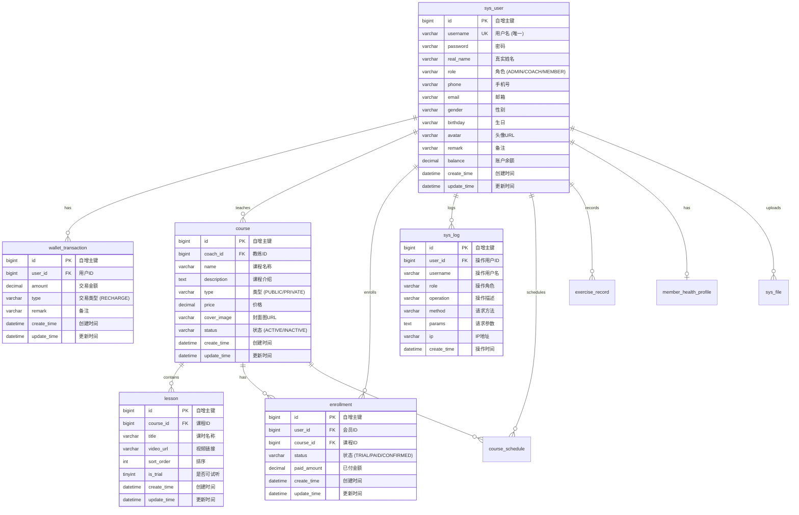

### 4.2 字段详细说明

| 字段 | 类型 | 约束 | 说明 |
|------|------|------|------|
| id | BIGINT | PK, AUTO_INCREMENT | 自增主键 |
| username | VARCHAR(64) | UNIQUE, NOT NULL | 用户名，唯一标识 |
| password | VARCHAR(128) | NOT NULL | 密码（当前明文存储） |
| real_name | VARCHAR(64) | - | 真实姓名 |
| role | VARCHAR(32) | NOT NULL | 用户角色：ADMIN/COACH/MEMBER |
| phone | VARCHAR(32) | - | 手机号码 |
| email | VARCHAR(128) | - | 电子邮箱 |
| gender | VARCHAR(16) | - | 性别 |
| birthday | VARCHAR(32) | - | 生日（存储为字符串） |
| avatar | VARCHAR(255) | - | 头像URL |
| remark | VARCHAR(500) | - | 备注信息 |
| balance | DECIMAL(10,2) | DEFAULT 0.00 | 账户余额 |
| create_time | DATETIME | - | 记录创建时间 |
| update_time | DATETIME | - | 记录更新时间 |
| deleted | TINYINT | DEFAULT 0 | 逻辑删除标志：0=正常，1=已删除 |

### 4.3 wallet_transaction 表（充值流水）

| 字段 | 类型 | 约束 | 说明 |
|------|------|------|------|
| id | BIGINT | PK, AUTO_INCREMENT | 自增主键 |
| user_id | BIGINT | NOT NULL, FK | 关联 sys_user.id |
| amount | DECIMAL(10,2) | NOT NULL | 交易金额 |
| type | VARCHAR(32) | NOT NULL | 交易类型：RECHARGE（充值）、WITHDRAW（提现）、CONSUME（课程消费）、COURSE_INCOME（卖课收入）、ADJUST（余额调整） |
| remark | VARCHAR(255) | - | 备注信息 |
| create_time | DATETIME | - | 记录创建时间 |
| update_time | DATETIME | - | 记录更新时间 |
| deleted | TINYINT | DEFAULT 0 | 逻辑删除标志：0=正常，1=已删除 |

### 4.4 course 表（课程）

| 字段 | 类型 | 约束 | 说明 |
|------|------|------|------|
| id | BIGINT | PK, AUTO_INCREMENT | 自增主键 |
| coach_id | BIGINT | NOT NULL, FK | 关联 sys_user.id（教练） |
| name | VARCHAR(128) | NOT NULL | 课程名称 |
| description | TEXT | - | 课程介绍 |
| type | VARCHAR(32) | NOT NULL | 类型：PUBLIC（公共课）、PRIVATE（私教） |
| price | DECIMAL(10,2) | DEFAULT 0.00 | 价格，0表示免费 |
| cover_image | VARCHAR(500) | - | 封面图片URL |
| status | VARCHAR(32) | DEFAULT ACTIVE | 状态：ACTIVE（上架）、INACTIVE（下架） |
| create_time | DATETIME | - | 创建时间 |
| update_time | DATETIME | - | 更新时间 |
| deleted | TINYINT | DEFAULT 0 | 逻辑删除 |

### 4.5 lesson 表（课时）

| 字段 | 类型 | 约束 | 说明 |
|------|------|------|------|
| id | BIGINT | PK, AUTO_INCREMENT | 自增主键 |
| course_id | BIGINT | NOT NULL, FK | 关联 course.id |
| title | VARCHAR(128) | NOT NULL | 课时名称 |
| video_url | VARCHAR(500) | - | 视频链接 |
| sort_order | INT | DEFAULT 0 | 排序序号 |
| is_trial | TINYINT | DEFAULT 0 | 是否可试听：0=否，1=是 |
| create_time | DATETIME | - | 创建时间 |
| update_time | DATETIME | - | 更新时间 |
| deleted | TINYINT | DEFAULT 0 | 逻辑删除 |

### 4.6 enrollment 表（选课）

| 字段 | 类型 | 约束 | 说明 |
|------|------|------|------|
| id | BIGINT | PK, AUTO_INCREMENT | 自增主键 |
| user_id | BIGINT | NOT NULL, FK | 关联 sys_user.id（会员） |
| course_id | BIGINT | NOT NULL, FK | 关联 course.id |
| status | VARCHAR(32) | NOT NULL | 状态：TRIAL（试听）、PAID（已付费）、CONFIRMED（教练已确认） |
| paid_amount | DECIMAL(10,2) | DEFAULT 0.00 | 已付金额 |
| create_time | DATETIME | - | 创建时间 |
| update_time | DATETIME | - | 更新时间 |
| deleted | TINYINT | DEFAULT 0 | 逻辑删除 |

### 4.7 sys_log 表（操作日志）

| 字段 | 类型 | 约束 | 说明 |
|------|------|------|------|
| id | BIGINT | PK, AUTO_INCREMENT | 自增主键 |
| user_id | BIGINT | - | 操作用户ID |
| username | VARCHAR(64) | - | 操作用户名 |
| role | VARCHAR(32) | - | 操作角色：ADMIN/COACH/MEMBER |
| operation | VARCHAR(128) | - | 操作描述（如：新增用户、删除课程） |
| method | VARCHAR(255) | - | 请求方法（如：POST UserController.registerUser） |
| params | TEXT | - | 请求参数（JSON格式） |
| ip | VARCHAR(64) | - | 操作IP地址 |
| create_time | DATETIME | - | 操作时间 |
| deleted | TINYINT | DEFAULT 0 | 逻辑删除 |

### 4.8 chat_conversation 表（会话）

| 字段 | 类型 | 约束 | 说明 |
|------|------|------|------|
| id | BIGINT | PK, AUTO_INCREMENT | 自增主键 |
| type | VARCHAR(16) | NOT NULL | 会话类型：GROUP（群聊）、PRIVATE（私信） |
| name | VARCHAR(128) | - | 群聊名称（私信为空） |
| course_id | BIGINT | - | 关联课程ID（可空） |
| owner_id | BIGINT | - | 群主ID（私信为空） |
| create_time | DATETIME | - | 创建时间 |
| update_time | DATETIME | - | 更新时间 |
| deleted | TINYINT | DEFAULT 0 | 逻辑删除 |

### 4.9 chat_conversation_member 表（会话成员）

| 字段 | 类型 | 约束 | 说明 |
|------|------|------|------|
| id | BIGINT | PK, AUTO_INCREMENT | 自增主键 |
| conversation_id | BIGINT | NOT NULL | 关联 chat_conversation.id |
| user_id | BIGINT | NOT NULL | 关联 sys_user.id |
| joined_at | DATETIME | - | 加入时间 |
| deleted | TINYINT | DEFAULT 0 | 逻辑删除 |

### 4.10 chat_message 表（聊天消息）

| 字段 | 类型 | 约束 | 说明 |
|------|------|------|------|
| id | BIGINT | PK, AUTO_INCREMENT | 自增主键 |
| conversation_id | BIGINT | NOT NULL | 关联 chat_conversation.id |
| sender_id | BIGINT | NOT NULL | 发送者ID |
| content | TEXT | NOT NULL | 消息内容 |
| msg_type | VARCHAR(16) | DEFAULT TEXT | 消息类型：TEXT/IMAGE/SYSTEM |
| create_time | DATETIME | - | 发送时间 |
| deleted | TINYINT | DEFAULT 0 | 逻辑删除 |

### 4.11 notification 表（通知）

| 字段 | 类型 | 约束 | 说明 |
|------|------|------|------|
| id | BIGINT | PK, AUTO_INCREMENT | 自增主键 |
| user_id | BIGINT | NOT NULL | 接收者ID |
| title | VARCHAR(128) | - | 通知标题 |
| content | TEXT | - | 通知内容 |
| type | VARCHAR(32) | - | 通知类型：SYSTEM/COURSE/GROUP |
| related_id | BIGINT | - | 关联ID（课程ID/会话ID） |
| is_read | TINYINT | DEFAULT 0 | 是否已读：0=未读，1=已读 |
| create_time | DATETIME | - | 创建时间 |
| deleted | TINYINT | DEFAULT 0 | 逻辑删除 |

### 4.12 chat_friend_request 表（好友/加群申请）

| 字段 | 类型 | 约束 | 说明 |
|------|------|------|------|
| id | BIGINT | PK, AUTO_INCREMENT | 自增主键 |
| from_user_id | BIGINT | NOT NULL | 申请人ID |
| to_user_id | BIGINT | NOT NULL | 处理人ID（好友/私信为对方，加群为群主） |
| request_type | VARCHAR(16) | NOT NULL | 申请类型：FRIEND（好友）、TEMP_CHAT（临时会话）、JOIN_GROUP（加群） |
| conversation_id | BIGINT | - | 关联会话ID（加群申请时使用） |
| status | VARCHAR(16) | DEFAULT PENDING | 状态：PENDING（待处理）、APPROVED（已同意）、REJECTED（已拒绝） |
| message | VARCHAR(255) | - | 申请留言 |
| create_time | DATETIME | - | 申请时间 |
| update_time | DATETIME | - | 处理时间 |
| deleted | TINYINT | DEFAULT 0 | 逻辑删除 |

### 4.13 chat_read_status 表（消息已读状态）

| 字段 | 类型 | 约束 | 说明 |
|------|------|------|------|
| id | BIGINT | PK, AUTO_INCREMENT | 自增主键 |
| user_id | BIGINT | NOT NULL | 用户ID |
| conversation_id | BIGINT | NOT NULL | 会话ID |
| last_read_message_id | BIGINT | DEFAULT 0 | 最后已读消息ID |
| update_time | DATETIME | - | 更新时间 |
| UNIQUE KEY | (user_id, conversation_id) | - | 用户+会话唯一约束 |

### 4.14 chat_group_notice 表（群公告）

| 字段 | 类型 | 约束 | 说明 |
|------|------|------|------|
| id | BIGINT | PK, AUTO_INCREMENT | 自增主键 |
| conversation_id | BIGINT | NOT NULL | 群聊会话ID |
| publisher_id | BIGINT | NOT NULL | 发布者ID（群主） |
| content | TEXT | NOT NULL | 公告内容 |
| create_time | DATETIME | - | 发布时间 |
| update_time | DATETIME | - | 更新时间 |
| deleted | TINYINT | DEFAULT 0 | 逻辑删除 |

### 4.15 course_schedule 表（排课）

| 字段 | 类型 | 约束 | 说明 |
|------|------|------|------|
| id | BIGINT | PK, AUTO_INCREMENT | 自增主键 |
| course_id | BIGINT | NOT NULL, FK | 关联 course.id |
| coach_id | BIGINT | NOT NULL, FK | 关联 sys_user.id（教练） |
| title | VARCHAR(128) | NOT NULL | 排课标题 |
| start_time | DATETIME | NOT NULL | 开始时间 |
| end_time | DATETIME | NOT NULL | 结束时间 |
| location | VARCHAR(255) | - | 上课地点 |
| color | VARCHAR(32) | - | 日历显示颜色 |
| create_time | DATETIME | - | 创建时间 |
| update_time | DATETIME | - | 更新时间 |
| deleted | TINYINT | DEFAULT 0 | 逻辑删除 |

### 4.16 exercise_record 表（运动记录）

| 字段 | 类型 | 约束 | 说明 |
|------|------|------|------|
| id | BIGINT | PK, AUTO_INCREMENT | 自增主键 |
| user_id | BIGINT | NOT NULL, FK | 关联 sys_user.id |
| type | VARCHAR(32) | NOT NULL | 运动类型 |
| duration | INT | NOT NULL, DEFAULT 0 | 时长（分钟） |
| distance | DECIMAL(8,2) | DEFAULT 0 | 距离（km） |
| calories | INT | DEFAULT 0 | 热量消耗（kcal） |
| heart_rate_avg | INT | - | 平均心率（bpm） |
| heart_rate_max | INT | - | 最大心率（bpm） |
| pace | VARCHAR(16) | - | 配速 |
| exercise_date | DATE | NOT NULL | 运动日期 |
| notes | VARCHAR(500) | - | 备注 |
| create_time | DATETIME | - | 创建时间 |
| update_time | DATETIME | - | 更新时间 |
| deleted | TINYINT | DEFAULT 0 | 逻辑删除 |

### 4.17 member_health_profile 表（健康档案）

| 字段 | 类型 | 约束 | 说明 |
|------|------|------|------|
| id | BIGINT | PK, AUTO_INCREMENT | 自增主键 |
| user_id | BIGINT | NOT NULL, UNIQUE | 关联 sys_user.id（一对一） |
| **健康信息** | | | |
| height | DECIMAL(5,1) | - | 身高（cm） |
| weight | DECIMAL(5,1) | - | 体重（kg） |
| body_fat | DECIMAL(4,1) | - | 体脂率（%） |
| muscle_mass | DECIMAL(5,1) | - | 肌肉量（kg） |
| bp_systolic | INT | - | 收缩压（mmHg） |
| bp_diastolic | INT | - | 舒张压（mmHg） |
| resting_heart_rate | INT | - | 静息心率（bpm） |
| blood_type | VARCHAR(16) | - | 血型 |
| allergies | TEXT | - | 过敏史 |
| medical_history | TEXT | - | 既往病史 |
| current_medications | TEXT | - | 目前用药 |
| emergency_contact_name | VARCHAR(64) | - | 紧急联系人姓名 |
| emergency_contact_phone | VARCHAR(32) | - | 紧急联系人电话 |
| **达成目标** | | | |
| target_weight | DECIMAL(5,1) | - | 目标体重 |
| target_body_fat | DECIMAL(4,1) | - | 目标体脂率 |
| target_muscle_mass | DECIMAL(5,1) | - | 目标肌肉量 |
| fitness_goal | VARCHAR(32) | - | 健身目标类型 |
| weekly_workout_freq | INT | - | 每周训练频率 |
| target_date | DATE | - | 期望达成日期 |
| goal_notes | TEXT | - | 目标备注 |
| create_time | DATETIME | - | 创建时间 |
| update_time | DATETIME | - | 更新时间 |
| deleted | TINYINT | DEFAULT 0 | 逻辑删除 |

### 4.18 sys_file 表（文件管理）

| 字段 | 类型 | 约束 | 说明 |
|------|------|------|------|
| id | BIGINT | PK, AUTO_INCREMENT | 自增主键 |
| original_name | VARCHAR(255) | NOT NULL | 原始文件名 |
| stored_name | VARCHAR(255) | NOT NULL | 存储文件名（日期+UUID） |
| file_path | VARCHAR(500) | NOT NULL | 文件存储路径 |
| file_size | BIGINT | NOT NULL | 文件大小（字节） |
| file_type | VARCHAR(128) | - | MIME类型 |
| upload_user_id | BIGINT | - | 上传用户ID |
| upload_username | VARCHAR(64) | - | 上传用户名 |
| create_time | DATETIME | - | 上传时间 |

### 4.19 Course/Lesson 表新增字段

#### course 表新增字段

| 字段 | 类型 | 默认值 | 说明 |
|------|------|--------|------|
| category | VARCHAR(32) | 'OTHER' | 课程分类 |
| difficulty | VARCHAR(16) | 'BEGINNER' | 难度等级 |
| max_students | INT | 0 | 最大学员数 |
| location | VARCHAR(255) | NULL | 上课地点 |
| start_date | DATE | NULL | 开课日期 |
| tags | VARCHAR(500) | NULL | 标签 |
| total_lessons | INT | 0 | 总课时数 |
| frequency | VARCHAR(32) | NULL | 上课频率 |
| schedule_mode | VARCHAR(16) | 'MANUAL' | 排课模式（MANUAL/AUTO） |
| default_time_slot | VARCHAR(16) | NULL | 默认时间段 |

#### lesson 表新增字段

| 字段 | 类型 | 默认值 | 说明 |
|------|------|--------|------|
| description | VARCHAR(500) | NULL | 课时描述 |
| duration | INT | 0 | 课时时长（分钟） |

### 4.20 check_in_record 表（签到记录）

| 字段 | 类型 | 约束 | 说明 |
|------|------|------|------|
| id | BIGINT | PK, AUTO_INCREMENT | 自增主键 |
| schedule_id | BIGINT | NOT NULL | 关联 course_schedule.id（排课ID） |
| user_id | BIGINT | NOT NULL | 签到用户ID |
| role | VARCHAR(16) | NOT NULL | 角色：COACH/MEMBER |
| check_in_time | DATETIME | - | 签到时间 |
| status | VARCHAR(16) | DEFAULT PENDING | 状态：PENDING（待签到）、SIGNED（已签到）、ABSENT（缺勤） |
| create_time | DATETIME | - | 创建时间 |
| update_time | DATETIME | - | 更新时间 |
| deleted | TINYINT | DEFAULT 0 | 逻辑删除 |

**索引**：
- `idx_schedule_user` (schedule_id, user_id)
- `uk_schedule_user_role` (schedule_id, user_id, role) — 唯一约束

### 4.21 agent_chat_message 表（AI助手聊天记录）

| 字段 | 类型 | 约束 | 说明 |
|------|------|------|------|
| id | BIGINT | PK, AUTO_INCREMENT | 自增主键 |
| memory_id | VARCHAR(64) | NOT NULL | 会话ID，格式：`userId_role`（如 `6_MEMBER`） |
| role | VARCHAR(16) | NOT NULL | 消息角色：SYSTEM/USER/ASSISTANT/AI |
| content | TEXT | NOT NULL | 消息内容（JSON格式） |
| create_time | DATETIME | - | 创建时间 |

**索引**：
- `idx_memory_id` (memory_id)

### 5.1 统一响应格式

所有API返回统一的JSON格式：

```json
{
  "code": 200,
  "message": "操作成功",
  "data": {}
}
```

| 字段 | 类型 | 说明 |
|------|------|------|
| code | Integer | 状态码，200表示成功 |
| message | String | 提示信息 |
| data | Object | 响应数据 |

### 5.2 接口列表

#### 5.2.1 用户注册

- **URL**: `POST /api/auth/register`
- **功能**: 新用户注册（不允许注册管理员）

**请求参数**:
```json
{
  "username": "string",
  "password": "string",
  "realName": "string",
  "role": "COACH | MEMBER",
  "phone": "string",
  "email": "string"
}
```

**响应示例**:
```json
{
  "code": 200,
  "message": "注册成功",
  "data": {
    "id": 1,
    "username": "coach001",
    "realName": "张教练",
    "role": "COACH",
    "phone": "13800138000",
    "email": "coach@example.com"
  }
}
```

**业务逻辑**:
1. 检查角色是否为ADMIN，如果是则拒绝注册
2. 检查用户名是否已存在
3. 检查邮箱是否已被其他用户绑定
4. 创建用户记录，密码明文存储
5. 返回用户基本信息

---

#### 5.2.2 用户登录

- **URL**: `POST /api/auth/login`
- **功能**: 用户身份验证

**请求参数**:
```json
{
  "username": "string",
  "password": "string",
  "role": "ADMIN | COACH | MEMBER"
}
```

**响应示例**:
```json
{
  "code": 200,
  "message": "登录成功",
  "data": {
    "id": 1,
    "username": "coach001",
    "realName": "张教练",
    "role": "COACH",
    "phone": "13800138000",
    "email": "coach@example.com",
    "token": "550e8400-e29b-41d4-a716-446655440000"
  }
}
```

**业务逻辑**:
1. 根据用户名+密码+角色三元组查询数据库
2. 如无匹配记录则抛出异常"用户名、密码或角色错误"
3. 生成随机UUID作为token返回（未存储、未验证）

---

#### 5.2.3 修改密码

- **URL**: `POST /api/auth/change-password`
- **功能**: 用户修改自己的密码

**请求参数**:
```json
{
  "username": "string",
  "role": "ADMIN | COACH | MEMBER",
  "oldPassword": "string",
  "newPassword": "string"
}
```

**响应示例**:
```json
{
  "code": 200,
  "message": "密码修改成功",
  "data": null
}
```

**业务逻辑**:
1. 验证用户名+角色+原密码是否匹配
2. 如不匹配则抛出异常"用户名、角色或原密码错误"
3. 更新密码为新值（明文存储）

---

#### 5.2.4 重置密码

- **URL**: `POST /api/auth/reset-password`
- **功能**: 管理员级密码重置（无需验证旧密码）

**请求参数**:
```json
{
  "username": "string",
  "role": "ADMIN | COACH | MEMBER",
  "newPassword": "string"
}
```

**响应示例**:
```json
{
  "code": 200,
  "message": "密码重置成功",
  "data": null
}
```

**业务逻辑**:
1. 验证用户名+角色是否存在
2. 如不存在则抛出异常"用户不存在或身份不匹配"
3. 直接更新密码为新值（无需旧密码）

---

#### 5.2.5 获取个人资料

- **URL**: `GET /api/auth/profile/{id}`
- **功能**: 根据用户ID获取个人资料

**路径参数**:
| 参数 | 类型 | 说明 |
|------|------|------|
| id | Long | 用户ID |

**响应示例**:
```json
{
  "code": 200,
  "message": "success",
  "data": {
    "id": 1,
    "username": "coach001",
    "realName": "张教练",
    "role": "COACH",
    "phone": "13800138000",
    "email": "coach@example.com",
    "gender": "男",
    "birthday": "1990-01-01",
    "avatar": "https://example.com/avatar.jpg",
    "remark": "高级教练"
  }
}
```

---

#### 5.2.6 更新个人资料

- **URL**: `POST /api/auth/profile`
- **功能**: 更新用户个人信息

**请求参数**:
```json
{
  "id": 1,
  "realName": "string",
  "phone": "string",
  "email": "string",
  "gender": "string",
  "birthday": "string",
  "avatar": "string",
  "remark": "string"
}
```

**响应示例**:
```json
{
  "code": 200,
  "message": "个人信息保存成功",
  "data": {
    "id": 1,
    "username": "coach001",
    "realName": "张教练",
    "role": "COACH",
    "phone": "13800138000",
    "email": "coach@example.com",
    "gender": "男",
    "birthday": "1990-01-01",
    "avatar": "https://example.com/avatar.jpg",
    "remark": "高级教练"
  }
}
```

**业务逻辑**:
1. 根据ID查询用户
2. 如不存在则抛出异常"用户不存在"
3. 更新可编辑字段（realName, phone, email, gender, birthday, avatar, remark）
4. 设置updateTime为当前时间
5. 返回更新后的用户资料

---

#### 5.2.7 发送邮箱验证码

- **URL**: `POST /api/auth/send-code`
- **功能**: 发送邮箱验证码用于找回密码

**请求参数**:
```json
{
  "contact": "user@example.com"
}
```

**响应示例**:
```json
{
  "code": 200,
  "message": "验证码已发送到邮箱",
  "data": null
}
```

**业务逻辑**:
1. 检查邮箱是否已注册
2. 如未注册则抛出异常"该邮箱未注册"
3. 生成6位随机验证码
4. 发送验证码到邮箱
5. 验证码5分钟内有效

---

#### 5.2.8 验证码重置密码

- **URL**: `POST /api/auth/reset-password-by-code`
- **功能**: 通过邮箱验证码重置密码

**请求参数**:
```json
{
  "contact": "user@example.com",
  "code": "123456",
  "newPassword": "newpassword"
}
```

**响应示例**:
```json
{
  "code": 200,
  "message": "密码重置成功",
  "data": null
}
```

**业务逻辑**:
1. 验证验证码是否正确且未过期
2. 如验证失败则抛出异常"验证码错误或已过期"
3. 根据邮箱查询用户
4. 更新密码为新值

---

### 5.3 用户管理接口（管理员专用）

#### 5.3.1 管理员注册用户

- **URL**: `POST /api/user/register`
- **功能**: 管理员注册新用户（可注册任何角色）

**请求参数**:
```json
{
  "username": "string",
  "password": "string",
  "realName": "string",
  "role": "COACH | MEMBER",
  "phone": "string",
  "email": "string"
}
```

**响应示例**:
```json
{
  "code": 200,
  "message": "注册成功",
  "data": {
    "id": 5,
    "username": "newcoach",
    "realName": "新教练",
    "role": "COACH"
  }
}
```

**业务逻辑**:
1. 检查用户名是否已存在
2. 检查邮箱是否已被其他用户绑定
3. 创建用户记录

---

#### 5.3.2 分页查询用户列表

- **URL**: `GET /api/user/list`
- **功能**: 按角色分页查询用户，支持模糊搜索

**请求参数（Query）**:

| 参数 | 类型 | 必填 | 说明 |
|------|------|------|------|
| `pageNum` | int | 否 | 页码，默认1 |
| `pageSize` | int | 否 | 每页条数，默认10 |
| `keyword` | string | 否 | 搜索关键词（匹配用户名/姓名/手机号） |
| `role` | string | 是 | 用户角色（COACH 或 MEMBER） |

**响应示例**:
```json
{
  "code": 200,
  "message": "success",
  "data": {
    "records": [
      {
        "id": 2,
        "username": "coach",
        "realName": "张教练",
        "role": "COACH",
        "phone": "13800138000",
        "email": "coach@example.com",
        "gender": "男",
        "birthday": "1990-01-01",
        "avatar": null,
        "remark": "高级教练",
        "createTime": "2026-06-17T16:00:00",
        "updateTime": null
      }
    ],
    "total": 1,
    "size": 10,
    "current": 1,
    "pages": 1
  }
}
```

---

#### 5.3.3 更新用户信息

- **URL**: `PUT /api/user`
- **功能**: 管理员编辑用户资料（含用户名、密码、身份）

**请求参数**:
```json
{
  "id": 2,
  "username": "coach001",
  "password": "newpassword",
  "role": "COACH",
  "realName": "张教练",
  "phone": "13800138000",
  "email": "coach@example.com",
  "gender": "男",
  "birthday": "1990-01-01",
  "remark": "高级教练"
}
```

**响应**:
```json
{
  "code": 200,
  "message": "更新成功",
  "data": null
}
```

**业务逻辑**:
1. 根据ID查询用户
2. 如不存在则抛出异常"用户不存在"
3. 如修改用户名，检查新用户名是否已存在
4. 如修改邮箱，检查新邮箱是否已被其他用户绑定
5. 如密码不为空则更新密码
6. 更新其他可编辑字段

---

#### 5.3.4 删除用户

- **URL**: `DELETE /api/user/{id}`
- **功能**: 逻辑删除单个用户

**路径参数**:

| 参数 | 类型 | 说明 |
|------|------|------|
| `id` | Long | 用户ID |

**响应**:
```json
{
  "code": 200,
  "message": "删除成功",
  "data": null
}
```

---

#### 5.3.5 批量删除用户

- **URL**: `DELETE /api/user/batch`
- **功能**: 批量逻辑删除用户

**请求参数**（Body）:
```json
[2, 3, 4]
```

**响应**:
```json
{
  "code": 200,
  "message": "批量删除成功",
  "data": null
}
```

---

### 5.4 钱包管理接口

#### 5.4.1 会员充值

- **URL**: `POST /api/finance/recharge`
- **功能**: 为指定会员增加余额，并记录充值流水

**请求参数**:
```json
{
  "userId": 1,
  "amount": 100.00,
  "remark": "充值100元"
}
```

**响应示例**:
```json
{
  "code": 200,
  "message": "充值成功",
  "data": {
    "id": 1,
    "username": "member001",
    "realName": "张三",
    "role": "MEMBER",
    "balance": 100.00
  }
}
```

**业务逻辑**:
1. 校验充值金额必须大于0
2. 查询用户是否存在
3. 在事务中更新用户余额（balance += amount）
4. 插入充值流水记录（type = "RECHARGE"）
5. 返回更新后的用户信息

---

#### 5.4.2 查询余额

- **URL**: `GET /api/finance/balance/{userId}`
- **功能**: 查询指定用户的当前余额

**路径参数**:

| 参数 | 类型 | 说明 |
|------|------|------|
| userId | Long | 用户ID |

**响应示例**:
```json
{
  "code": 200,
  "message": "success",
  "data": 100.00
}
```

---

#### 5.4.3 查询充值流水

- **URL**: `GET /api/finance/transactions`
- **功能**: 分页查询指定用户的充值流水记录

**请求参数（Query）**:

| 参数 | 类型 | 必填 | 说明 |
|------|------|------|------|
| userId | Long | 是 | 用户ID |
| pageNum | int | 否 | 页码，默认1 |
| pageSize | int | 否 | 每页条数，默认10 |

**响应示例**:
```json
{
  "code": 200,
  "message": "success",
  "data": {
    "records": [
      {
        "id": 1,
        "userId": 1,
        "amount": 100.00,
        "type": "RECHARGE",
        "remark": "充值100元",
        "createTime": "2026-06-18T10:00:00"
      }
    ],
    "total": 1,
    "size": 10,
    "current": 1,
    "pages": 1
  }
}
```

---

#### 5.4.4 修改会员余额（管理员）

- **URL**: `PUT /api/finance/balance`
- **功能**: 管理员直接修改指定会员的余额

**请求参数**:
```json
{
  "userId": 1,
  "balance": 500.00
}
```

**响应示例**:
```json
{
  "code": 200,
  "message": "余额更新成功",
  "data": {
    "id": 1,
    "username": "member001",
    "realName": "张三",
    "role": "MEMBER",
    "balance": 500.00
  }
}
```

**业务逻辑**:
1. 校验余额不能为负数
2. 查询用户是否存在
3. 计算差额，在事务中更新余额
4. 记录调整流水（type = "ADJUST"）
5. 返回更新后的用户信息

---

#### 5.4.5 教练提现

- **URL**: `POST /api/finance/withdraw`
- **功能**: 教练从余额中提现

**请求参数**:
```json
{
  "userId": 1,
  "amount": 200.00,
  "remark": "提现200元"
}
```

**响应示例**:
```json
{
  "code": 200,
  "message": "提现成功",
  "data": {
    "id": 1,
    "username": "coach001",
    "realName": "张教练",
    "role": "COACH",
    "balance": 800.00
  }
}
```

**业务逻辑**:
1. 校验提现金额必须大于0
2. 查询用户是否存在
3. 校验余额是否充足（balance >= amount）
4. 在事务中扣减余额（balance -= amount）
5. 记录提现流水（type = "WITHDRAW"）
6. 返回更新后的用户信息

---

#### 5.4.6 导出账单

- **URL**: `GET /api/finance/export`
- **功能**: 导出用户账单为CSV文件

**请求参数（Query）**:

| 参数 | 类型 | 必填 | 说明 |
|------|------|------|------|
| userId | Long | 是 | 用户ID |
| type | string | 否 | 交易类型筛选（RECHARGE/CONSUME/COURSE_INCOME/WITHDRAW/ADJUST） |
| period | string | 是 | 时间范围：WEEK（本周）、MONTH（本月）、YEAR（本年） |

**响应**: CSV文件流（Content-Type: text/csv），包含以下字段：
- 时间、类型、金额、备注

**业务逻辑**:
1. 根据 userId 查询交易记录
2. 如指定 type，按交易类型筛选
3. 根据 period 计算起始日期，筛选时间范围内的记录
4. 按时间升序排列
5. 生成 CSV 格式文件并返回下载

---

### 5.5 课程管理接口

#### 5.5.1 创建课程

- **URL**: `POST /api/course?coachId={coachId}`
- **功能**: 教练创建新课程（自动生效，暂不审批）

**请求参数**:
```json
{
  "name": "瑜伽入门",
  "description": "适合初学者的瑜伽课程",
  "type": "PUBLIC",
  "price": 0,
  "coverImage": "https://example.com/cover.jpg"
}
```

**业务逻辑**:
1. 校验用户是否为教练角色
2. 校验课程名称不为空
3. 创建课程，默认状态 ACTIVE

---

#### 5.5.2 修改课程信息

- **URL**: `PUT /api/course?coachId={coachId}`
- **功能**: 教练修改自己的课程信息

---

#### 5.5.3 修改课程价格

- **URL**: `PUT /api/course/price?coachId={coachId}&courseId={courseId}&newPrice={newPrice}`
- **功能**: 教练修改课程价格

---

#### 5.5.4 浏览课程列表

- **URL**: `GET /api/course/list`
- **功能**: 分页浏览课程，支持按类型筛选和模糊查询

**请求参数（Query）**:

| 参数 | 类型 | 必填 | 说明 |
|------|------|------|------|
| type | string | 否 | PUBLIC 或 PRIVATE |
| keyword | string | 否 | 搜索关键词（匹配课程名称/介绍） |
| pageNum | int | 否 | 页码，默认1 |
| pageSize | int | 否 | 每页条数，默认10 |

---

#### 5.5.5 获取课程详情

- **URL**: `GET /api/course/{id}`
- **功能**: 获取课程详情

---

#### 5.5.6 教练的课程列表

- **URL**: `GET /api/course/my?coachId={coachId}`
- **功能**: 教练查看自己创建的课程

---

### 5.6 课时管理接口

#### 5.6.1 添加课时

- **URL**: `POST /api/lesson?coachId={coachId}`
- **功能**: 教练为课程添加课时

**请求参数**:
```json
{
  "courseId": 1,
  "title": "第一课：基础动作",
  "videoUrl": "https://oss.example.com/video1.mp4",
  "sortOrder": 1,
  "isTrial": 1
}
```

---

#### 5.6.2 删除课时

- **URL**: `DELETE /api/lesson/{id}?coachId={coachId}`
- **功能**: 教练删除自己课程的课时

---

#### 5.6.3 获取课时列表

- **URL**: `GET /api/lesson/list?courseId={courseId}`
- **功能**: 获取课程的所有课时

---

### 5.7 选课接口

#### 5.7.1 选课/报名

- **URL**: `POST /api/enrollment?userId={userId}`
- **功能**: 会员选课

**请求参数**:
```json
{
  "courseId": 1
}
```

**业务逻辑**:
1. 免费课程：直接标记 PAID
2. 付费公共课：标记 TRIAL（试听状态）
3. 付费私教：标记 TRIAL，需教练确认

---

#### 5.7.2 付费解锁

- **URL**: `POST /api/enrollment/pay?userId={userId}&courseId={courseId}`
- **功能**: 会员付费解锁课程

**业务逻辑**:
1. 校验余额是否充足
2. 扣减会员余额
3. 增加教练余额
4. 更新选课状态为 PAID
5. 记录交易流水（type="COURSE"）

---

#### 5.7.3 教练确认选课

- **URL**: `PUT /api/enrollment/confirm/{id}?coachId={coachId}`
- **功能**: 教练确认私教选课

---

#### 5.7.4 我的课程

- **URL**: `GET /api/enrollment/my?userId={userId}&type={type}`
- **功能**: 会员查看已报名课程

---

#### 5.7.5 课程学员列表

- **URL**: `GET /api/enrollment/students?coachId={coachId}&courseId={courseId}&keyword={keyword}`
- **功能**: 教练查看报名自己课程的学员（支持模糊查询）

---

### 5.8 系统管理接口（管理员专用）

#### 5.8.1 操作日志查询

- **URL**: `GET /api/log/list`
- **功能**: 分页查询操作日志，支持多条件筛选

**请求参数（Query）**:

| 参数 | 类型 | 必填 | 说明 |
|------|------|------|------|
| pageNum | int | 否 | 页码，默认1 |
| pageSize | int | 否 | 每页条数，默认10 |
| keyword | string | 否 | 模糊搜索（匹配用户名/操作/IP） |
| role | string | 否 | 角色筛选：ADMIN/COACH/MEMBER |
| operationType | string | 否 | 操作类型：登录/注册/新增/编辑/删除/查询 |
| startTime | string | 否 | 开始时间（YYYY-MM-DD） |
| endTime | string | 否 | 结束时间（YYYY-MM-DD） |

**响应示例**:
```json
{
  "code": 200,
  "message": "success",
  "data": {
    "records": [
      {
        "id": 1,
        "userId": 1,
        "username": "admin",
        "role": "ADMIN",
        "operation": "新增用户",
        "method": "POST UserController.registerUser",
        "params": "[{\"username\":\"coach001\"}]",
        "ip": "127.0.0.1",
        "createTime": "2026-06-18T10:00:00"
      }
    ],
    "total": 100,
    "size": 10,
    "current": 1
  }
}
```

**业务逻辑**:
1. AOP切面自动拦截所有Controller方法
2. 记录操作人、操作描述、请求方法、参数、IP、时间
3. 自动识别操作类型（登录/注册/CRUD/其他）

---

#### 5.8.2 删除日志

- **URL**: `DELETE /api/log/{id}`
- **功能**: 删除单条日志记录

---

#### 5.8.3 批量删除日志

- **URL**: `DELETE /api/log/batch`
- **功能**: 批量删除日志记录

**请求参数**（Body）:
```json
[1, 2, 3]
```

---

#### 5.8.4 SQL监控（Druid）

- **URL**: `GET /api/druid/`
- **功能**: 通过 Druid 内置 UI 查看 SQL 执行统计、慢查询、连接池状态等
- **实现方式**: 使用 `druid-spring-boot-3-starter` 自动注册 StatViewServlet，通过 `DruidDataSourceConfig.java` 手动创建数据源 Bean 避免与 MyBatis-Plus 冲突
- **登录凭据**: 用户名 `admin`，密码 `admin`
- **前端页面**: `SqlMonitorView.vue` 通过 iframe 嵌入 Druid UI

---

#### 5.8.6 系统监控信息

- **URL**: `GET /api/systemMonitor/info`
- **功能**: 获取服务器系统信息（OSHI采集）

**响应示例**:
```json
{
  "code": 200,
  "message": "success",
  "data": {
    "os": { "name": "Windows 11", "version": "10.0", "arch": "amd64", "uptime": "3天 5小时 30分钟" },
    "cpu": { "name": "Intel Core i7", "cores": 8, "logicalCores": 16, "load": 25.5, "frequency": "3.20 GHz" },
    "memory": { "total": "16.00 GB", "used": "8.50 GB", "available": "7.50 GB", "usage": 53.13 },
    "jvm": { "name": "Java HotSpot VM", "version": "17.0.2", "totalMemory": "256.00 MB", "usage": 45.2 },
    "disk": [{ "name": "C:", "mount": "C:\\", "type": "NTFS", "total": "500.00 GB", "usage": 65.3 }],
    "network": [{ "name": "eth0", "mac": "00:11:22:33:44:55", "ipv4": "[192.168.1.100]", "speed": "1000000000 bps" }],
    "app": { "name": "智训业财云", "version": "1.0.0", "startupTime": "2026-06-18 08:00:00", "runTime": "5小时 30分钟" }
  }
}
```

---

#### 5.8.7 获取数据库表列表

- **URL**: `GET /api/db/tables`
- **功能**: 获取当前数据库所有表名

**响应示例**:
```json
{
  "code": 200,
  "message": "success",
  "data": ["sys_user", "sys_log", "course", "lesson", "enrollment", "wallet_transaction"]
}
```

---

#### 5.8.8 获取表结构

- **URL**: `GET /api/db/table/{tableName}`
- **功能**: 获取指定表的字段结构信息

**响应示例**:
```json
{
  "code": 200,
  "message": "success",
  "data": [
    { "COLUMN_NAME": "id", "COLUMN_TYPE": "bigint", "IS_NULLABLE": "NO", "COLUMN_KEY": "PRI", "COLUMN_DEFAULT": null, "COLUMN_COMMENT": "" },
    { "COLUMN_NAME": "username", "COLUMN_TYPE": "varchar(64)", "IS_NULLABLE": "NO", "COLUMN_KEY": "UNI", "COLUMN_DEFAULT": null, "COLUMN_COMMENT": "" }
  ]
}
```

---

#### 5.8.9 查询表数据

- **URL**: `GET /api/db/table/{tableName}/data`
- **功能**: 分页查询指定表的数据

**请求参数（Query）**:

| 参数 | 类型 | 必填 | 说明 |
|------|------|------|------|
| pageNum | int | 否 | 页码，默认1 |
| pageSize | int | 否 | 每页条数，默认20 |
| keyword | string | 否 | 模糊搜索（匹配文本类型字段） |

---

#### 5.8.10 新增表数据

- **URL**: `POST /api/db/table/{tableName}/data`
- **功能**: 向指定表插入一条记录

**请求参数**（Body，字段名为表字段）:
```json
{
  "username": "newuser",
  "password": "123456",
  "realName": "新用户",
  "role": "MEMBER"
}
```

---

#### 5.8.11 编辑表数据

- **URL**: `PUT /api/db/table/{tableName}/data`
- **功能**: 更新指定表的一条记录

**请求参数**（Body）:
```json
{
  "_pkColumn": "id",
  "_pkValue": 1,
  "realName": "修改后的姓名"
}
```

---

#### 5.8.12 删除表数据

- **URL**: `DELETE /api/db/table/{tableName}/data/{pkColumn}/{pkValue}`
- **功能**: 删除指定表的一条记录

---

#### 5.8.13 批量删除表数据

- **URL**: `DELETE /api/db/table/{tableName}/data/batch`
- **功能**: 批量删除指定表的记录

**请求参数**（Body）:
```json
{
  "pkColumn": "id",
  "pkValues": [1, 2, 3]
}
```

---

### 5.9 聊天接口（教练/会员专用）

#### 5.9.1 获取会话列表

- **URL**: `GET /api/chat/conversations`
- **功能**: 获取当前用户的会话列表（群聊+私信）

**请求参数（Query）**:

| 参数 | 类型 | 必填 | 说明 |
|------|------|------|------|
| userId | Long | 是 | 用户ID |
| pageNum | int | 否 | 页码，默认1 |
| pageSize | int | 否 | 每页条数，默认20 |

---

#### 5.9.2 按类型获取会话

- **URL**: `GET /api/chat/conversations/type`
- **功能**: 按类型获取会话列表

**请求参数（Query）**:

| 参数 | 类型 | 必填 | 说明 |
|------|------|------|------|
| userId | Long | 是 | 用户ID |
| type | String | 是 | GROUP 或 PRIVATE |

---

#### 5.9.3 获取历史消息

- **URL**: `GET /api/chat/conversations/{id}/messages`
- **功能**: 分页获取会话的历史消息

---

#### 5.9.4 创建会话

- **URL**: `POST /api/chat/conversations`
- **功能**: 创建群聊或私信会话

**请求参数**:
```json
{
  "type": "GROUP",
  "name": "瑜伽入门群聊",
  "courseId": 1,
  "ownerId": 2,
  "memberIds": [3, 4, 5]
}
```

---

#### 5.9.5 加入会话

- **URL**: `POST /api/chat/conversations/{id}/join?userId={userId}`
- **功能**: 用户加入会话

---

#### 5.9.6 获取未读消息数

- **URL**: `GET /api/chat/unread?userId={userId}`
- **功能**: 获取当前用户的未读消息总数

---

#### 5.9.7 标记会话已读

- **URL**: `POST /api/chat/conversations/{id}/read?userId={userId}`
- **功能**: 标记指定会话的所有消息为已读

---

#### 5.9.8 获取未读会话列表

- **URL**: `GET /api/chat/unread-conversations?userId={userId}`
- **功能**: 获取有未读消息的会话列表（含最后一条消息预览）

---

#### 5.9.9 WebSocket 连接

- **URL**: `ws://localhost:8080/api/ws/chat?userId={userId}`
- **功能**: 实时消息通信

**发送消息格式**:
```json
{
  "action": "send",
  "conversationId": 1,
  "content": "你好！",
  "msgType": "TEXT"
}
```

**接收消息格式**:
```json
{
  "type": "message",
  "conversationId": 1,
  "senderId": 2,
  "content": "你好！",
  "msgType": "TEXT",
  "messageId": 100,
  "createTime": "2026-06-18T18:00:00"
}
```

---

#### 5.9.12 获取群成员列表

- **URL**: `GET /api/chat/conversations/{id}/members`
- **功能**: 获取群聊的所有成员

---

#### 5.9.13 添加群成员

- **URL**: `POST /api/chat/conversations/{id}/members?userId={userId}`
- **功能**: 向群聊添加成员

---

#### 5.9.14 移除群成员

- **URL**: `DELETE /api/chat/conversations/{id}/members/{userId}`
- **功能**: 从群聊移除成员（群主权限）

---

#### 5.9.15 修改群聊名称

- **URL**: `PUT /api/chat/conversations/{id}`
- **功能**: 修改群聊名称（群主权限）

**请求参数**:
```json
{
  "name": "新群名"
}
```

---

#### 5.9.16 退出群聊

- **URL**: `POST /api/chat/conversations/{id}/leave?userId={userId}`
- **功能**: 退出群聊

---

#### 5.9.17 获取群公告

- **URL**: `GET /api/chat/conversations/{id}/notice`
- **功能**: 获取群聊最新公告

---

#### 5.9.18 发布群公告

- **URL**: `POST /api/chat/conversations/{id}/notice`
- **功能**: 发布群公告（群主权限）

**请求参数**:
```json
{
  "publisherId": 1,
  "content": "公告内容"
}
```

---

#### 5.9.19 删除群公告

- **URL**: `DELETE /api/chat/notice/{id}`
- **功能**: 删除群公告（群主权限）

---

### 5.10 通知接口

#### 5.10.1 获取通知列表

- **URL**: `GET /api/notification/list`
- **功能**: 分页获取用户通知

**请求参数（Query）**:

| 参数 | 类型 | 必填 | 说明 |
|------|------|------|------|
| userId | Long | 是 | 用户ID |
| pageNum | int | 否 | 页码，默认1 |
| pageSize | int | 否 | 每页条数，默认20 |

---

#### 5.10.2 标记已读

- **URL**: `PUT /api/notification/{id}/read`
- **功能**: 标记通知为已读

---

#### 5.10.3 获取未读通知数

- **URL**: `GET /api/notification/unread?userId={userId}`
- **功能**: 获取未读通知数量

---

### 5.11 好友/加群申请接口

#### 5.11.1 搜索用户

- **URL**: `GET /api/friend/search?username={username}`
- **功能**: 通过用户名搜索用户

---

#### 5.11.2 发送好友/会话申请

- **URL**: `POST /api/friend/request`
- **功能**: 发送好友申请或临时会话申请

**请求参数**:
```json
{
  "fromUserId": 1,
  "toUserId": 2,
  "type": "FRIEND",
  "message": "你好，我想加你为好友"
}
```

type 可选值：FRIEND（好友）、TEMP_CHAT（临时会话）

---

#### 5.11.3 发送加群申请

- **URL**: `POST /api/friend/join-group`
- **功能**: 申请加入群聊（需群主同意）

**请求参数**:
```json
{
  "userId": 1,
  "conversationId": 5,
  "message": "我想加入这个群"
}
```

---

#### 5.11.4 同意申请

- **URL**: `POST /api/friend/approve/{id}?operatorId={operatorId}`
- **功能**: 同意好友/会话/加群申请

---

#### 5.11.5 拒绝申请

- **URL**: `POST /api/friend/reject/{id}?operatorId={operatorId}`
- **功能**: 拒绝申请

---

#### 5.11.6 获取我的申请列表

- **URL**: `GET /api/friend/requests?userId={userId}&status={status}&pageNum={pageNum}&pageSize={pageSize}`
- **功能**: 获取收到的申请列表（可按状态筛选）

---

### 5.12 排课管理接口

#### 5.12.1 获取教练排课列表

- **URL**: `GET /api/schedule/coach`
- **功能**: 获取教练的排课列表，支持时间范围过滤

**请求参数（Query）**:

| 参数 | 类型 | 必填 | 说明 |
|------|------|------|------|
| coachId | Long | 是 | 教练ID |
| from | String | 否 | 开始时间（ISO DateTime） |
| to | String | 否 | 结束时间（ISO DateTime） |

**业务逻辑**:
1. 按教练ID查询排课记录
2. 如指定时间范围，按 start_time 过滤
3. 按开始时间升序排列

---

#### 5.12.2 获取学员排课列表

- **URL**: `GET /api/schedule/member`
- **功能**: 获取学员可见的排课列表（已报名且已确认的课程）

**请求参数（Query）**:

| 参数 | 类型 | 必填 | 说明 |
|------|------|------|------|
| userId | Long | 是 | 学员ID |
| from | String | 否 | 开始时间（ISO DateTime） |
| to | String | 否 | 结束时间（ISO DateTime） |

**业务逻辑**:
1. 通过 enrollment 表查询学员已报名且状态为 PAID/CONFIRMED 的课程
2. 查询这些课程的排课记录
3. 按开始时间升序排列

---

#### 5.12.3 创建排课

- **URL**: `POST /api/schedule?coachId={coachId}`
- **功能**: 教练为自己的课程创建排课

**请求参数**:
```json
{
  "courseId": 1,
  "title": "瑜伽入门第一课",
  "startTime": "2026-06-25T09:00:00",
  "endTime": "2026-06-25T10:00:00",
  "location": "A栋301教室",
  "color": "#409EFF"
}
```

**业务逻辑**:
1. 验证课程是否属于该教练
2. 自动设置 coachId 和 createTime
3. 创建排课记录

---

#### 5.12.4 更新排课

- **URL**: `PUT /api/schedule?coachId={coachId}`
- **功能**: 教练更新排课信息

**请求参数**:
```json
{
  "id": 1,
  "courseId": 1,
  "title": "瑜伽入门第一课（修改）",
  "startTime": "2026-06-25T09:00:00",
  "endTime": "2026-06-25T10:30:00",
  "location": "B栋201教室",
  "color": "#67C23A"
}
```

**业务逻辑**:
1. 验证排课记录是否属于该教练
2. 更新 title/startTime/endTime/location/color/updateTime

---

#### 5.12.5 删除排课

- **URL**: `DELETE /api/schedule/{id}?coachId={coachId}`
- **功能**: 教练删除排课记录

**业务逻辑**:
1. 验证排课记录是否属于该教练
2. 逻辑删除排课记录

---

#### 5.12.6 自动排课

- **URL**: `POST /api/schedule/auto?coachId={coachId}&courseId={courseId}`
- **功能**: 根据课程配置自动生成排课计划

**业务逻辑**:
1. 读取课程配置：totalLessons（总课时）、frequency（频率）、startDate（开始日期）、defaultTimeSlot（默认时间段）、location（地点）
2. 支持频率类型：DAILY（每天）、WEEKLY_1（每周1次）、WEEKLY_2（每周2次）、WEEKLY_3（每周3次）、BIWEEKLY（隔周）
3. 冲突检测：优先使用默认时间段，冲突则遍历14个时间段（08:00-21:00）
4. 颜色自动分配：8色调色板按 courseId 取模
5. 防无限循环：maxIterations = totalLessons × 10

---

#### 5.12.7 清除自动排课

- **URL**: `DELETE /api/schedule/auto?coachId={coachId}&courseId={courseId}`
- **功能**: 删除某教练某课程的所有排课记录

---

### 5.13 运动记录接口

#### 5.13.1 获取运动记录列表

- **URL**: `GET /api/exercise/list`
- **功能**: 获取用户的运动记录列表，支持日期范围过滤

**请求参数（Query）**:

| 参数 | 类型 | 必填 | 说明 |
|------|------|------|------|
| userId | Long | 是 | 用户ID |
| from | String | 否 | 开始日期（ISO Date） |
| to | String | 否 | 结束日期（ISO Date） |

---

#### 5.13.2 获取运动统计

- **URL**: `GET /api/exercise/stats`
- **功能**: 获取用户运动统计数据

**请求参数（Query）**:

| 参数 | 类型 | 必填 | 说明 |
|------|------|------|------|
| userId | Long | 是 | 用户ID |
| from | String | 否 | 开始日期 |
| to | String | 否 | 结束日期 |

**响应示例**:
```json
{
  "code": 200,
  "message": "success",
  "data": {
    "totalDuration": 1200,
    "totalDistance": 50.5,
    "totalCalories": 8000,
    "totalDays": 15,
    "totalSessions": 20,
    "avgDuration": 60,
    "avgCalories": 400,
    "totalRunning": 30.5,
    "outdoorRunning": 20.0,
    "indoorRunning": 10.5,
    "avgPace": "5'30"
  }
}
```

---

#### 5.13.3 获取运动趋势

- **URL**: `GET /api/exercise/trend`
- **功能**: 获取最近N天的运动趋势数据

**请求参数（Query）**:

| 参数 | 类型 | 必填 | 说明 |
|------|------|------|------|
| userId | Long | 是 | 用户ID |
| days | Int | 否 | 天数，默认30 |

**响应示例**:
```json
{
  "code": 200,
  "message": "success",
  "data": [
    { "date": "2026-06-23", "duration": 60, "calories": 400, "distance": 5.0 },
    { "date": "2026-06-22", "duration": 45, "calories": 300, "distance": 3.5 }
  ]
}
```

---

#### 5.13.4 添加运动记录

- **URL**: `POST /api/exercise?userId={userId}`
- **功能**: 添加运动记录

**请求参数**:
```json
{
  "type": "户外跑步",
  "duration": 60,
  "distance": 5.0,
  "calories": 400,
  "heartRateAvg": 145,
  "heartRateMax": 175,
  "pace": "5'30",
  "exerciseDate": "2026-06-23",
  "notes": "天气不错，跑得很舒服"
}
```

---

#### 5.13.5 删除运动记录

- **URL**: `DELETE /api/exercise/{id}?userId={userId}`
- **功能**: 删除运动记录（需验证归属）

---

### 5.14 健康档案接口

#### 5.14.1 获取健康档案

- **URL**: `GET /api/health/profile?userId={userId}`
- **功能**: 获取用户健康档案

**响应示例**:
```json
{
  "code": 200,
  "message": "success",
  "data": {
    "id": 1,
    "userId": 1,
    "height": 175.0,
    "weight": 70.0,
    "bodyFat": 18.5,
    "muscleMass": 55.0,
    "bpSystolic": 120,
    "bpDiastolic": 80,
    "restingHeartRate": 65,
    "bloodType": "A",
    "allergies": "花粉",
    "medicalHistory": "无",
    "currentMedications": "无",
    "emergencyContactName": "张三",
    "emergencyContactPhone": "13800138000",
    "targetWeight": 65.0,
    "targetBodyFat": 15.0,
    "fitnessGoal": "减脂塑形",
    "weeklyWorkoutFreq": 4,
    "targetDate": "2026-12-31",
    "goalNotes": "希望在年底前达到目标"
  }
}
```

---

#### 5.14.2 保存/更新健康档案

- **URL**: `PUT /api/health/profile?userId={userId}`
- **功能**: 创建或更新健康档案（Upsert逻辑）

**请求参数**:
```json
{
  "height": 175.0,
  "weight": 70.0,
  "bodyFat": 18.5,
  "muscleMass": 55.0,
  "bpSystolic": 120,
  "bpDiastolic": 80,
  "restingHeartRate": 65,
  "bloodType": "A",
  "targetWeight": 65.0,
  "targetBodyFat": 15.0,
  "fitnessGoal": "减脂塑形",
  "weeklyWorkoutFreq": 4
}
```

**业务逻辑**:
1. 查询是否已存在该用户的健康档案
2. 如不存在则新建（设置 userId, createTime）
3. 如已存在则更新（保留原 id 和 createTime，设置 updateTime）

---

### 5.15 文件管理接口

#### 5.15.1 上传文件

- **URL**: `POST /api/file/upload`
- **功能**: 上传文件

**请求参数**（FormData）:

| 参数 | 类型 | 必填 | 说明 |
|------|------|------|------|
| file | File | 是 | 文件内容 |
| userId | Long | 否 | 上传用户ID |
| username | String | 否 | 上传用户名 |

**业务逻辑**:
1. 存储路径：`${file.upload-dir:./uploads}`
2. 文件名格式：`yyyyMMdd_UUID.ext`
3. 同时写入数据库和物理文件
4. 文件大小限制：50MB

---

#### 5.15.2 获取文件列表

- **URL**: `GET /api/file/list`
- **功能**: 获取文件列表

**请求参数（Query）**:

| 参数 | 类型 | 必填 | 说明 |
|------|------|------|------|
| userId | Long | 否 | 按上传用户过滤 |

---

#### 5.15.3 下载文件

- **URL**: `GET /api/file/download/{id}`
- **功能**: 下载文件（返回文件流）

---

#### 5.15.4 删除文件

- **URL**: `DELETE /api/file/{id}`
- **功能**: 删除文件（同时删除物理文件和数据库记录）

---

### 5.16 CSV数据分析接口

#### 5.16.1 分析CSV文件

- **URL**: `POST /api/csv/analyze`
- **功能**: 上传并分析CSV文件

**请求参数**（FormData）:

| 参数 | 类型 | 必填 | 说明 |
|------|------|------|------|
| file | File | 是 | CSV文件 |
| userId | Long | 否 | 用户ID（传入则自动保存文件） |
| username | String | 否 | 用户名 |

**响应示例**:
```json
{
  "code": 200,
  "message": "success",
  "data": {
    "totalRecords": 100,
    "durationSeconds": 100,
    "durationFormatted": "1分40秒",
    "columns": [
      {
        "title": "心率",
        "data": [120, 135, 150, 165, 180],
        "avg": 150.0,
        "max": 180,
        "min": 120,
        "zones": {
          "热身区(<120)": 10,
          "燃脂区(120-140)": 25,
          "有氧区(140-160)": 40,
          "无氧区(160-180)": 20,
          "极限区(>=180)": 5
        }
      },
      {
        "title": "配速",
        "data": [5.5, 5.3, 5.0, 4.8, 5.2],
        "avg": 5.2,
        "max": 5.5,
        "min": 4.8,
        "zones": null
      }
    ]
  }
}
```

**业务逻辑**:
1. 自动保存：若传入 userId/username，自动保存原始CSV文件
2. 智能列检测：遍历所有CSV列，有效数字比例 > 50% 判定为数值列
3. 统计计算：对每个数值列计算 avg/max/min
4. 心率区间：当列名包含 "heart" 或 "hr" 时，计算5个区间分布

---

### 5.17 AI 智能助手接口

#### 5.17.1 AI 对话（SSE流式）

- **URL**: `GET /api/agent/chat`
- **功能**: AI 健身助手对话，通过 SSE (Server-Sent Events) 流式返回 AI 回复
- **协议**: SSE，Content-Type: `text/event-stream;charset=UTF-8`

**请求参数（Query）**:

| 参数 | 类型 | 必填 | 说明 |
|------|------|------|------|
| message | String | 是 | 用户消息 |
| userId | Long | 是 | 用户ID |
| role | String | 是 | 用户角色（COACH/MEMBER） |

**SSE 数据格式**:
```
data: 你好

data: ，

data: 我是

data: 智训健身助手

data: ！

data: [DONE]
```

- 每个 `data:` 行包含一个文本片段
- `data: [DONE]` 表示流式响应结束

**AI 工具能力**:

| 工具 | 功能 | 适用角色 |
|------|------|----------|
| ScheduleTool | 排课日程查询 | COACH/MEMBER |
| FinanceTool | 钱包余额、交易记录查询 | COACH/MEMBER |
| ExerciseTool | 运动统计、热量分析、记录列表 | COACH/MEMBER |
| HealthTool | 健康档案查询、个性化锻炼计划生成 | COACH/MEMBER |
| CheckInTool | 签到统计查询 | COACH/MEMBER |

**业务逻辑**:
1. 根据 userId + role 构建 memoryId，加载对话历史（最近20条）
2. 调用 DeepSeek API（通过 LangChain4j），系统提示词来自 `fitness-assistant.md`
3. AI 可自主调用上述5个工具查询业务数据
4. 流式返回 AI 回复，对话历史持久化到 `agent_chat_message` 表

---

### 5.18 签到管理接口

#### 5.18.1 签到

- **URL**: `POST /api/checkin`
- **功能**: 用户签到（课前30分钟到课程结束期间可签到）

**请求参数（Query）**:

| 参数 | 类型 | 必填 | 说明 |
|------|------|------|------|
| scheduleId | Long | 是 | 排课ID |
| userId | Long | 是 | 用户ID |
| role | String | 是 | 角色（COACH/MEMBER） |

**业务逻辑**:
1. 验证签到窗口（课前30分钟 ~ 课程结束）
2. 防重复签到检查
3. 创建签到记录（status = SIGNED）

---

#### 5.18.2 获取签到状态

- **URL**: `GET /api/checkin/status`
- **功能**: 查询指定排课的签到状态

**请求参数（Query）**:

| 参数 | 类型 | 必填 | 说明 |
|------|------|------|------|
| scheduleId | Long | 是 | 排课ID |
| userId | Long | 是 | 用户ID |
| role | String | 是 | 角色（COACH/MEMBER） |

---

#### 5.18.3 获取排课签到列表

- **URL**: `GET /api/checkin/schedule/{scheduleId}`
- **功能**: 获取指定排课的所有签到记录

---

#### 5.18.4 获取签到历史

- **URL**: `GET /api/checkin/history`
- **功能**: 获取用户的签到历史记录

**请求参数（Query）**:

| 参数 | 类型 | 必填 | 说明 |
|------|------|------|------|
| userId | Long | 是 | 用户ID |
| role | String | 是 | 角色（COACH/MEMBER） |
| from | DateTime | 否 | 开始时间（ISO DateTime） |
| to | DateTime | 否 | 结束时间（ISO DateTime） |

---

#### 5.18.5 获取签到统计

- **URL**: `GET /api/checkin/stats`
- **功能**: 获取用户签到统计数据

**请求参数（Query）**:

| 参数 | 类型 | 必填 | 说明 |
|------|------|------|------|
| userId | Long | 是 | 用户ID |
| role | String | 是 | 角色（COACH/MEMBER） |

**响应示例**:
```json
{
  "code": 200,
  "message": "success",
  "data": {
    "totalScheduled": 20,
    "totalSigned": 15,
    "totalAbsent": 3,
    "totalPending": 2,
    "checkInRate": 83.3
  }
}
```

---

### 6.1 注册流程

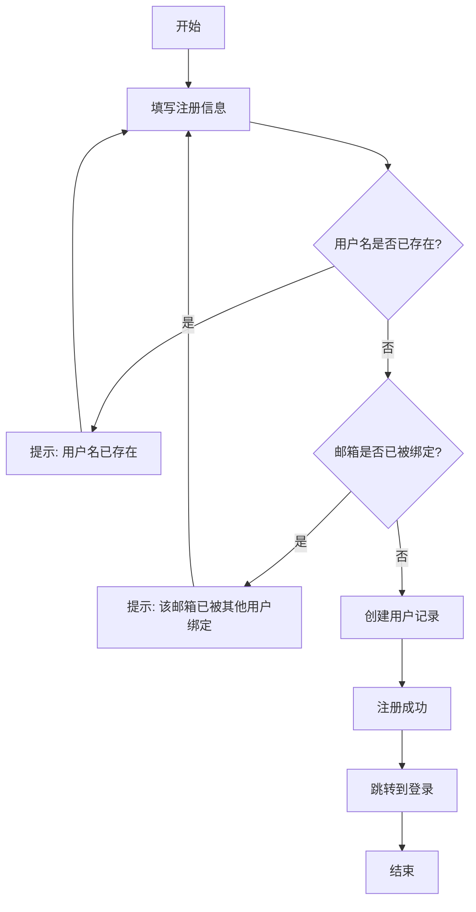

### 6.2 登录流程

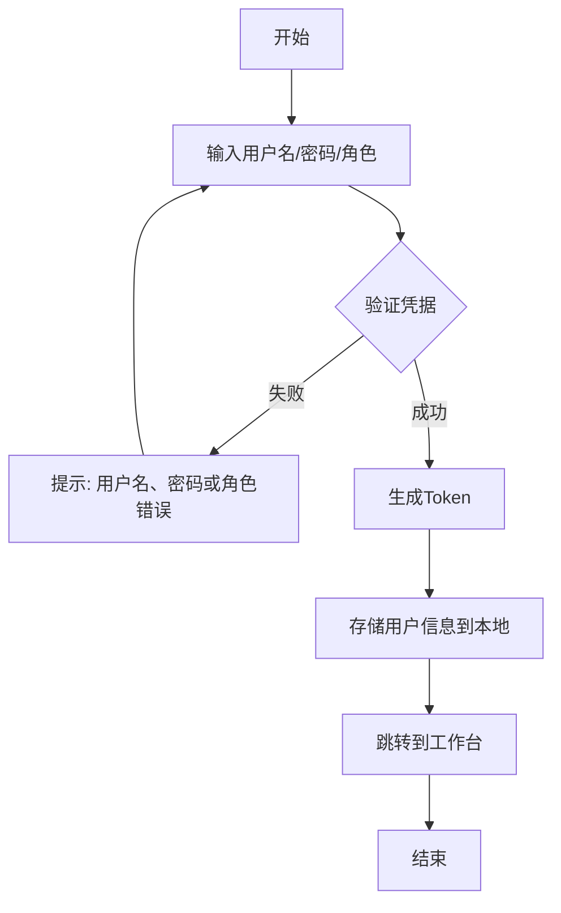

### 6.3 修改密码流程

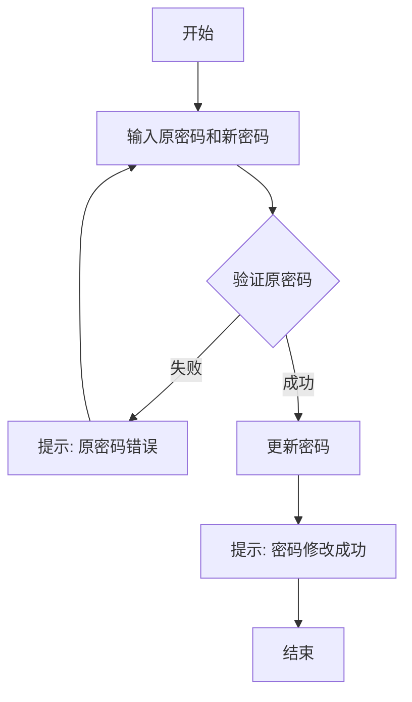

### 6.4 个人资料管理流程

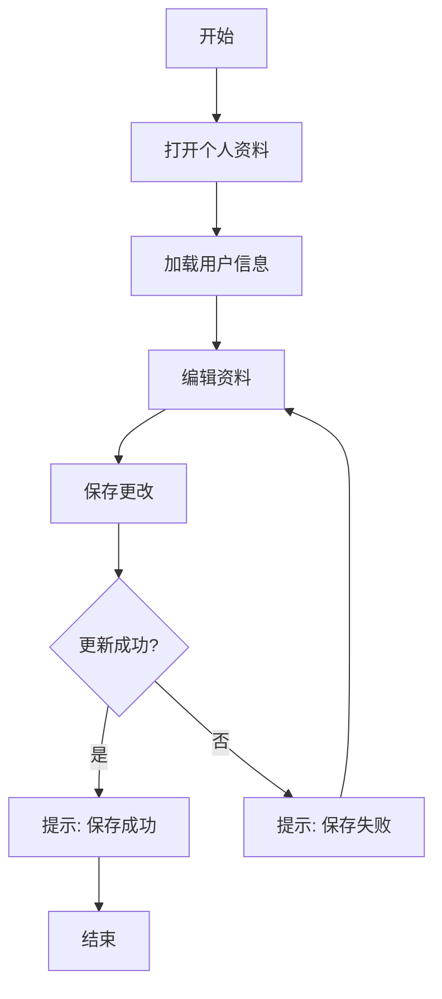

### 6.5 忘记密码流程（邮箱验证码）

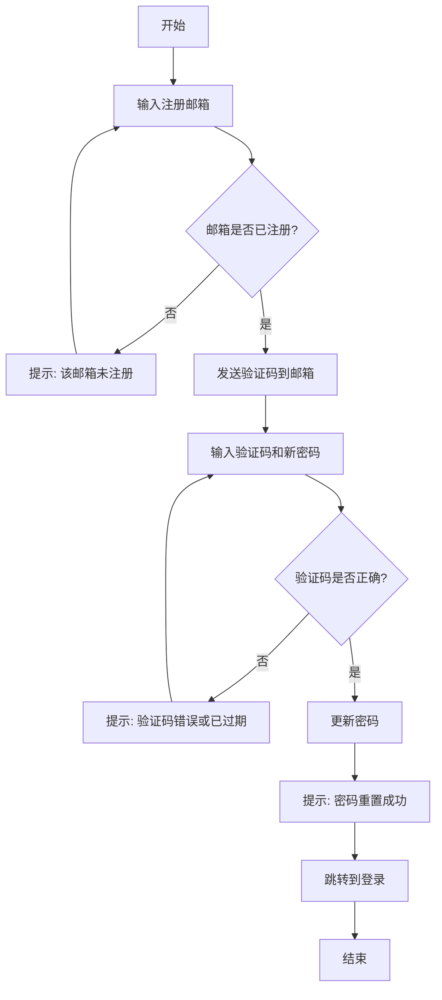

### 6.6 充值流程

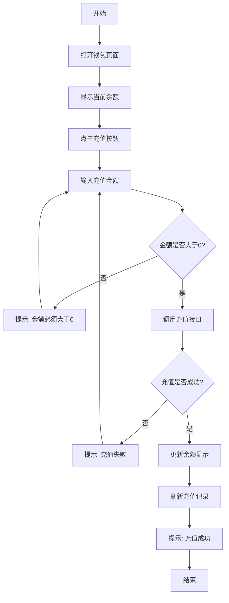

### 6.7 提现流程（教练）

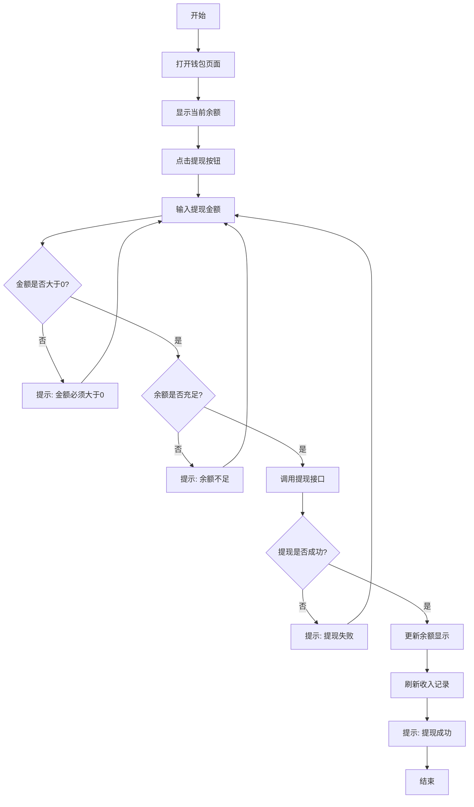

### 6.8 排课流程（手动排课）

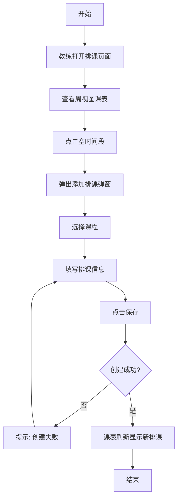

### 6.9 排课流程（自动排课）

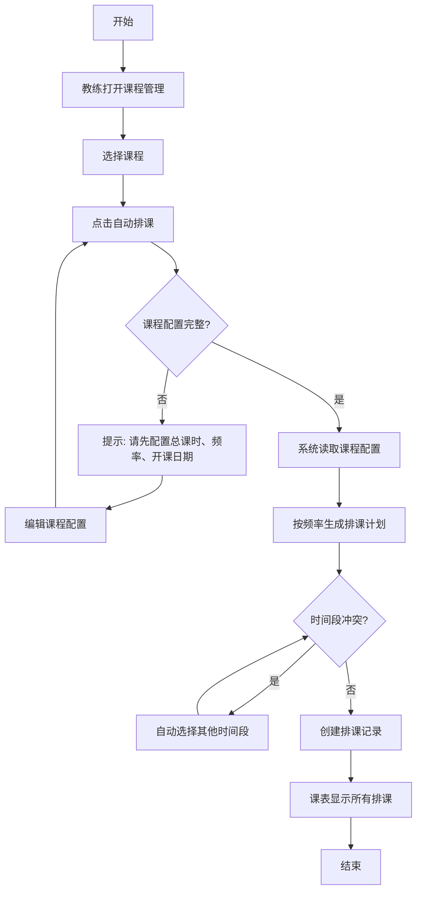

### 6.10 运动记录管理流程

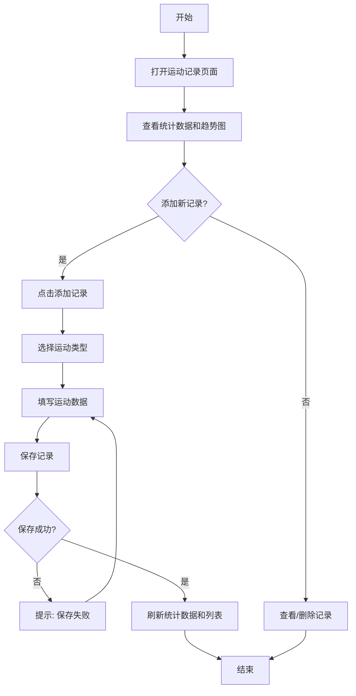

### 6.11 健康档案管理流程

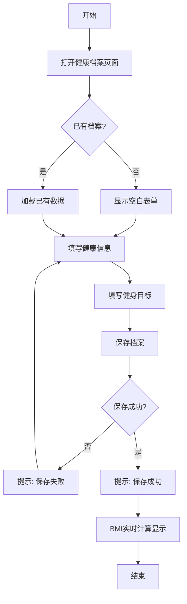

### 6.12 选课付费流程

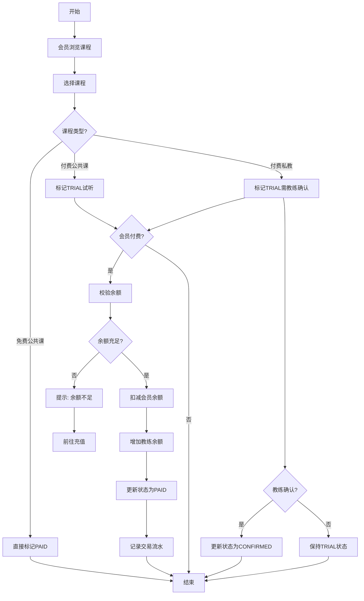

### 6.13 AI 助手对话流程

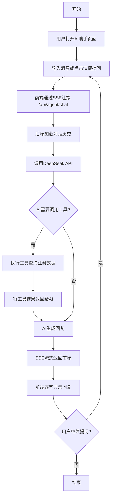

### 6.14 签到流程

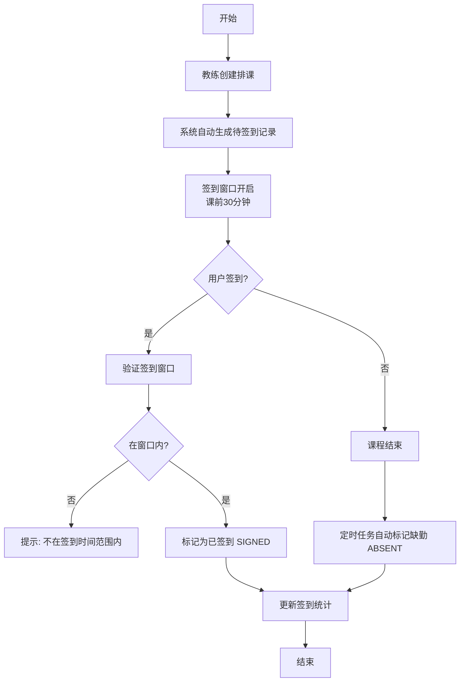

---

## 7. 前端架构

### 7.1 路由配置

| 路径 | 名称 | 组件 | 守卫逻辑 |
|------|------|------|----------|
| `/` | - | 重定向到 `/landing` | - |
| `/login` | login | LoginView.vue | 已登录则跳转 `/dashboard/workbench` |
| `/landing` | landing | LandingView.vue | 无守卫，公开访问 |
| `/dashboard` | - | AdminLayout.vue | 未登录则跳转 `/login` |
| `/dashboard/workbench` | workbench | WorkbenchView.vue | 继承父路由守卫 |
| `/dashboard/coaches` | coaches | CoachView.vue | 继承父路由守卫 |
| `/dashboard/coach-salary` | coach-salary | CoachSalaryView.vue | 继承父路由守卫 |
| `/dashboard/members` | members | MemberView.vue | 继承父路由守卫 |
| `/dashboard/member-balance` | member-balance | MemberBalanceView.vue | 继承父路由守卫 |
| `/dashboard/wallet` | wallet | WalletView.vue | 继承父路由守卫 |
| `/dashboard/logs` | logs | LogView.vue | 继承父路由守卫 |
| `/dashboard/sql-monitor` | sql-monitor | SqlMonitorView.vue | 继承父路由守卫 |
| `/dashboard/system-monitor` | system-monitor | SystemMonitorView.vue | 继承父路由守卫 |
| `/dashboard/db-control` | db-control | DbControlView.vue | 继承父路由守卫 |
| `/dashboard/files` | files | FileView.vue | 继承父路由守卫 |
| `/dashboard/csv-analysis` | csv-analysis | CsvAnalysisView.vue | 继承父路由守卫 |
| `/dashboard/ai-assistant` | ai-assistant | ChatAgentView.vue | 继承父路由守卫 |
| `/member/public-courses` | member-public-courses | PublicCourseView.vue | 继承父路由守卫 |
| `/member/private-courses` | member-private-courses | PrivateCourseView.vue | 继承父路由守卫 |
| `/member/my-courses` | member-my-courses | MyCoursesView.vue | 继承父路由守卫 |
| `/member/my-schedule` | member-my-schedule | MemberScheduleView.vue | 继承父路由守卫 |
| `/member/exercise` | member-exercise | MemberExerciseView.vue | 继承父路由守卫 |
| `/member/profile` | member-profile | MemberProfileView.vue | 继承父路由守卫 |
| `/member/checkin` | member-checkin | MemberCheckInView.vue | 继承父路由守卫 |
| `/coach/public-courses` | coach-public-courses | CoachPublicCourseView.vue | 继承父路由守卫 |
| `/coach/private-courses` | coach-private-courses | CoachPrivateCourseView.vue | 继承父路由守卫 |
| `/coach/my-courses` | coach-my-courses | CoachMyCoursesView.vue | 继承父路由守卫 |
| `/coach/my-students` | coach-my-students | CoachMyStudentsView.vue | 继承父路由守卫 |
| `/coach/my-schedule` | coach-my-schedule | CoachScheduleView.vue | 继承父路由守卫 |
| `/coach/checkin` | coach-checkin | CoachCheckInView.vue | 继承父路由守卫 |
| `/member/chat-group` | member-chat-group | GroupChatView.vue | 继承父路由守卫 |
| `/member/chat-private` | member-chat-private | PrivateChatView.vue | 继承父路由守卫 |
| `/coach/chat-group` | coach-chat-group | GroupChatView.vue | 继承父路由守卫 |
| `/coach/chat-private` | coach-chat-private | PrivateChatView.vue | 继承父路由守卫 |
| `/member/chat-requests` | member-chat-requests | RequestManageView.vue | 继承父路由守卫 |
| `/coach/chat-requests` | coach-chat-requests | RequestManageView.vue | 继承父路由守卫 |

**导航守卫逻辑**:
- 未登录用户访问 `/dashboard/**`、`/member/**`、`/coach/**` → 重定向到 `/login`
- 已登录用户访问 `/login` → 重定向到 `/dashboard/workbench`
- Token检查: `localStorage.getItem('access_token')`

**管理员专属菜单**:
- 仅 ADMIN 角色可见"用户管理"父菜单
- 子菜单：教练信息、教练工资、会员信息、会员金额
- 仅 ADMIN 角色可见"系统管理"父菜单
- 子菜单：日志管理、SQL监控、系统监控、数据库控制

**会员专属菜单**:
- 仅 MEMBER 角色可见"选课"父菜单
- 子菜单：公共课、私教
- "我的"菜单下新增：我的课程、我的课表、我的锻炼
- 仅 MEMBER/COACH 角色可见"聊天"父菜单
- 子菜单：群聊、私信、申请管理

**教练专属菜单**:
- 仅 COACH 角色可见"课程"父菜单
- 子菜单：公共课、私教课
- "我的"菜单下新增：我的课程、我的学员、我的课表
- 仅 MEMBER/COACH 角色可见"聊天"父菜单
- 子菜单：群聊、私信、申请管理

**公共菜单（所有角色）**:
- 工作台
- 文件管理

### 7.2 状态管理 (Pinia Store)

**Store名称**: `user`

**状态结构**:
```typescript
{
  user: LoginResult | null  // 用户信息，包含token
}
```

**持久化策略**: 双重持久化
- Pinia内存状态
- localStorage存储 `access_token` 和 `user_info`

**Actions**:
| 方法 | 功能 |
|------|------|
| `setUser(user)` | 设置用户状态，同时存储到localStorage |
| `updateProfile(profile)` | 更新用户资料，同步到localStorage |
| `logout()` | 清除状态和localStorage |

### 7.3 HTTP请求封装

**Axios配置**:
- 基础URL: `/api` (通过环境变量 `VITE_API_BASE_URL` 配置)
- 超时时间: 15000ms

**请求拦截器**:
- 自动添加 `Authorization: Bearer <token>` 请求头

**响应拦截器**:
- 成功响应: 解析 `ApiResponse.data`，当 `code === 200` 时返回数据
- 失败响应: 返回错误信息
- 401状态码: 清除 `access_token`

### 7.4 页面与组件结构

```
App.vue (根组件)
├── LoginView.vue (登录/注册页)
│   ├── 角色选择器 (注册时仅Coach/Member，登录时含Admin)
│   ├── 登录表单
│   ├── 注册表单 (含手机号、邮箱)
│   └── 忘记密码对话框 (邮箱验证码)
│
└── AdminLayout.vue (管理后台布局)
    ├── 侧边栏 (236px)
    │   ├── Logo区域
    │   └── 导航菜单
    │       ├── 工作栏 (所有角色可见)
│       │   ├── 工作台
│       │   ├── AI助手
│       │   └── CSV分析
│       ├── 用户管理 (仅ADMIN可见)
│       │   ├── 教练信息
│       │   ├── 教练工资
│       │   ├── 会员信息
│       │   └── 会员金额
│       ├── 系统管理 (仅ADMIN可见)
│       │   ├── 日志管理
│       │   ├── SQL监控
│       │   ├── 系统监控
│       │   └── 数据库控制
    │       ├── 选课 (仅MEMBER可见)
    │       │   ├── 公共课
    │       │   └── 私教
    │       ├── 课程 (仅COACH可见)
    │       │   ├── 公共课
    │       │   └── 私教课
    │       ├── 我的 (仅COACH/MEMBER可见)
    │       │   ├── 钱包
    │       │   ├── 我的课程 (MEMBER/COACH)
    │       │   ├── 我的学员 (仅COACH)
│       │       ├── 我的课表 (MEMBER/COACH)
│       │       ├── 我的锻炼 (仅MEMBER)
│       │       ├── 我的签到 (MEMBER/COACH)
│       │       └── 个人信息 (仅MEMBER)
    │       └── 文件管理 (所有角色可见)
    ├── 顶部栏 (76px)
    │   ├── 页面标题
    │   └── 用户面板 (角色标签、消息图标、通知图标、用户名下拉菜单)
    ├── <router-view /> (子路由出口)
    │   ├── LandingView.vue (落地页 - 独立页面)
    │   ├── WorkbenchView.vue (工作台)
    │   ├── ChatAgentView.vue (AI健身助手 - SSE流式对话)
    │   ├── CsvAnalysisView.vue (CSV数据分析)
    │   ├── CoachView.vue (教练信息管理)
    │   ├── CoachSalaryView.vue (教练工资管理)
    │   ├── MemberView.vue (会员信息管理)
    │   ├── MemberBalanceView.vue (会员金额管理)
    │   ├── WalletView.vue (钱包)
    │   ├── FileView.vue (文件管理)
    │   ├── LogView.vue (日志管理 - 仅ADMIN)
    │   ├── SqlMonitorView.vue (SQL监控 - 仅ADMIN)
    │   ├── SystemMonitorView.vue (系统监控 - 仅ADMIN)
    │   ├── DbControlView.vue (数据库控制 - 仅ADMIN)
    │   ├── PublicCourseView.vue (会员-公共课浏览)
    │   ├── PrivateCourseView.vue (会员-私教浏览)
    │   ├── MyCoursesView.vue (会员-我的课程)
    │   ├── MemberScheduleView.vue (会员-课表)
    │   ├── MemberExerciseView.vue (会员-运动记录)
    │   ├── MemberProfileView.vue (会员-个人信息/健康档案)
    │   ├── MemberCheckInView.vue (会员-签到)
    │   ├── CoachPublicCourseView.vue (教练-公共课管理)
    │   ├── CoachPrivateCourseView.vue (教练-私教课管理)
    │   ├── CoachMyCoursesView.vue (教练-我的课程)
    │   ├── CoachMyStudentsView.vue (教练-我的学员)
    │   ├── CoachScheduleView.vue (教练-排课管理)
    │   ├── CoachCheckInView.vue (教练-签到)
    │   ├── GroupChatView.vue (群聊列表+聊天室)
    │   └── PrivateChatView.vue (私信列表+聊天室)
    ├── 个人资料对话框
    └── 修改密码对话框
```

---

## 8. 安全与已知问题

### 8.1 当前安全缺陷

| 问题 | 严重程度 | 说明 |
|------|----------|------|
| 密码明文存储 | **严重** | 密码未使用BCrypt等哈希算法，数据库泄露将导致所有密码暴露 |
| Token未验证 | **严重** | 登录返回的UUID token未存储、未验证，任何人都可以访问所有API |
| 无认证鉴权 | **严重** | 没有Spring Security，所有API端点公开访问 |
| 无输入校验 | 中等 | DTO没有@Valid注解，未验证输入参数 |
| 无测试 | 中等 | 前后端均无单元测试或集成测试 |
| CORS全开 | 低 | @CrossOrigin允许所有来源，生产环境应限制 |

### 8.2 已实现的安全措施

| 措施 | 说明 |
|------|------|
| 邮箱唯一性 | 每个邮箱只能绑定一个用户 |
| 注册限制 | 公开注册接口不允许注册管理员角色 |
| 邮箱验证码 | 找回密码需要邮箱验证码验证 |

### 8.2 改进建议

#### 8.2.1 密码安全
```java
// 使用BCrypt进行密码哈希
import org.springframework.security.crypto.bcrypt.BCryptPasswordEncoder;

@Service
public class UserService {
    private final BCryptPasswordEncoder passwordEncoder = new BCryptPasswordEncoder();
    
    public User register(RegisterRequest request) {
        User user = new User();
        user.setPassword(passwordEncoder.encode(request.getPassword()));
        // ...
    }
}
```

#### 8.2.2 JWT认证
```java
// 引入JWT依赖
// pom.xml: spring-boot-starter-security, jjwt-api

// 生成JWT Token
import io.jsonwebtoken.Jwts;

public String generateToken(User user) {
    return Jwts.builder()
        .setSubject(user.getUsername())
        .claim("role", user.getRole())
        .setExpiration(new Date(System.currentTimeMillis() + 86400000))
        .signWith(SignatureAlgorithm.HS256, "secret-key")
        .compact();
}
```

#### 8.2.3 输入校验
```java
// 在DTO中添加校验注解
public class RegisterRequest {
    @NotBlank(message = "用户名不能为空")
    @Size(min = 3, max = 64, message = "用户名长度3-64位")
    private String username;
    
    @NotBlank(message = "密码不能为空")
    @Size(min = 6, max = 128, message = "密码长度6-128位")
    private String password;
}
```

#### 8.2.4 Spring Security配置
```java
@Configuration
@EnableWebSecurity
public class SecurityConfig {
    @Bean
    public SecurityFilterChain filterChain(HttpSecurity http) throws Exception {
        http
            .csrf(csrf -> csrf.disable())
            .authorizeHttpRequests(auth -> auth
                .requestMatchers("/api/auth/login", "/api/auth/register").permitAll()
                .anyRequest().authenticated()
            )
            .addFilterBefore(jwtAuthenticationFilter(), UsernamePasswordAuthenticationFilter.class);
        return http.build();
    }
}
```

---

## 附录

### A. 环境配置

**后端 application.yml 关键配置**:
- 服务端口: 8080
- 上下文路径: /api
- 数据库: jdbc:mariadb://localhost:3366/zhixun_erp
- 连接池: Druid (最小5, 最大20)
- SQL监控: Druid StatViewServlet (/api/druid/, 用户名admin, 密码admin)
- 邮箱SMTP: smtp.qq.com:465 (SSL)
- AI模型: DeepSeek (https://api.deepseek.com, model: deepseek-chat, temperature: 0.7)

**前端环境变量**:
- `VITE_API_BASE_URL=/api`
- Vite代理配置已启用WebSocket支持（`ws: true`）

### B. 启动命令

**后端**:
```bash
cd backend
mvn spring-boot:run
```

**前端**:
```bash
cd frontend
npm install
npm run dev
```

### C. 热启动配置

项目已配置热启动（Hot Reload），修改代码后自动生效：

**后端 (Spring Boot DevTools)**:
- 依赖：`spring-boot-devtools`（已在 `pom.xml` 中配置）
- Java 文件修改 → 应用自动重启
- 静态资源修改 → 自动刷新

**前端 (Vite HMR)**:
- Vite 内置热模块替换（HMR），无需额外配置
- `.vue` 文件修改 → 组件热更新
- `.ts`/`.js` 文件修改 → 页面自动刷新
- CSS 修改 → 样式即时替换

### D. 数据库初始化

数据库会在Spring Boot启动时自动执行 `schema.sql` 创建表结构。
如需手动初始化：
```sql
CREATE DATABASE IF NOT EXISTS zhixun_erp CHARACTER SET utf8mb4 COLLATE utf8mb4_unicode_ci;
```

### E. 账号配置

系统已预置三个测试账号：

| 角色 | 用户名 | 密码 |
|------|--------|------|
| 管理员 | admin | 123456 |
| 教练 | coach | coach123 |
| 会员 | member | member123 |
